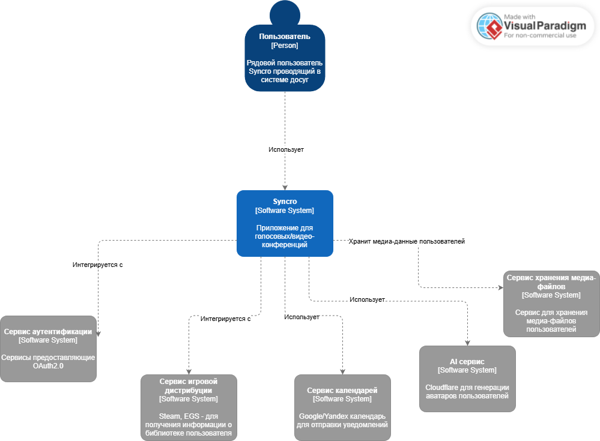
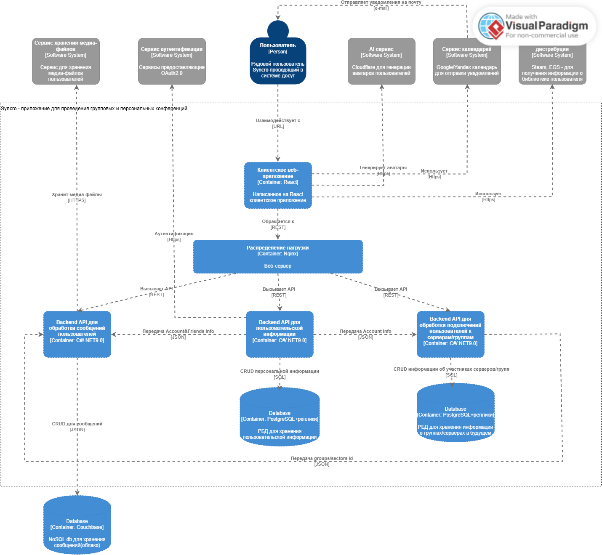
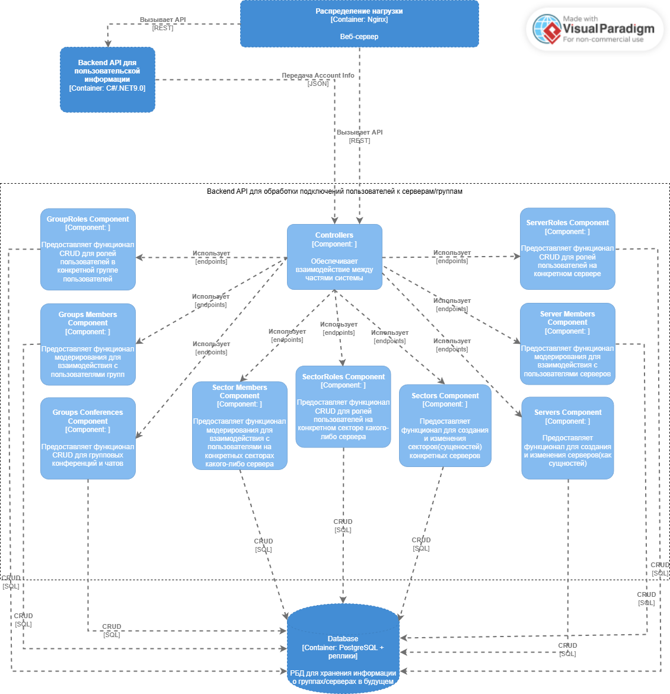

# Диаграмма системного контекста

Весь контекст в данном случае представлен самим приложением Syncro и подключаемыми интеграциями - Steam/EGS - для подтягивания информации о библиотеке пользователя, Календари - для отправки пользователю на почту/в приложении уведомлений о запланированных конференциях, OAuth2.0 Google/Yandex для минования регистрации, S3 хранилище - для хранения медиа-файлов и Cloudflare - для генерации ИИ-изображений аватаров пользователя. Выбор данных интегрируемых приложений может расширяться/сужаться по мере развития приложения.
# Диаграмма контейнеров

Архитектура приложения выбрана сервисной - сервис для Backend API пользовательской информации и 2 сервиса - для сообщений и участников серверов.
Такая архитектура была выбрана ввиду того, что подразумевается, что на 2 сервиса будет наложена самая высокая нагрузка в приложении. Поэтому целесообразно выделить для них отдельные БД, желательно NoSQL распределенные(так как подразумевается, что пользователи будут с разных точек страны/мира). Было решено не выносить всю архитектуру приложения в микросервисы. Так как на начальном этапе не предусматривается высокая нагрузка со стороны пользователей на такие элементы как аккаунты,персональные конференции(как сущности - не сообщения), разработка при 3-х скомпонованных элементах системы будет быстрее и удобнее, а это критично при высоком темпе разработки, который наблюдается у приложения сейчас. В то же время, методы масштабирования(горизонтальное и вертикальное) мало отличаются для сервисной архитектуры и монолитной, поэтому для ускорения разработки архитектура такова - основные пользовательские статические части приложения - Backend API пользовательской информации, нагруженные части - сообщения и сервера/группы в сервисах.
# Диаграмма компонентов
## Диаграмма компонентов Backend API для персональной информации

Данный контейнер и его компоненты - сервис, который отвечает за хранение персональной информации пользователя - аккаунт, друзья, персональные переписки с какими-либо пользователями. Все это будет подтягиваться из РБД postgresql для удобства проведения JOIN операций.
## Диаграмма компонентов Backend API для серверов/групп пользователей

Данный контейнер и его компоненты отвечают за взаимодействие пользователей в серверах(и секторах данных серверов), группах. В будущем сервис может быть разбит на 2 отдельных сервиса - по группам/серверам, однако сейчас это представляет излишним, так как цель выпустить MVP в кратчайшие сроки.
## Диаграмма компонентов Backend API для сообщений

Данный контейнер и его компоненты отвечают за обработку всех операций относящихся к сообщениям. Так как данный компонент будет одним из самых нагруженных, он вынесен отдельно
