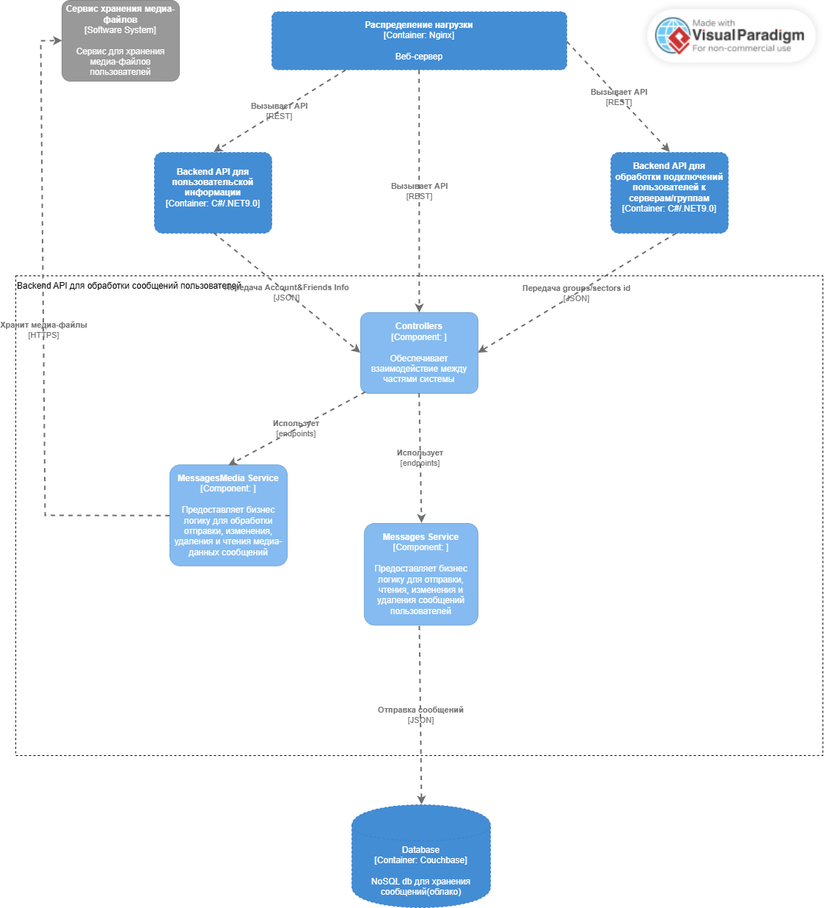
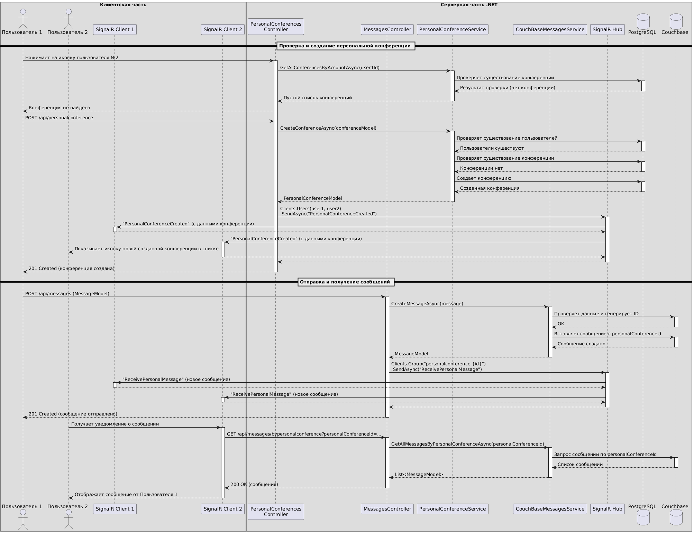
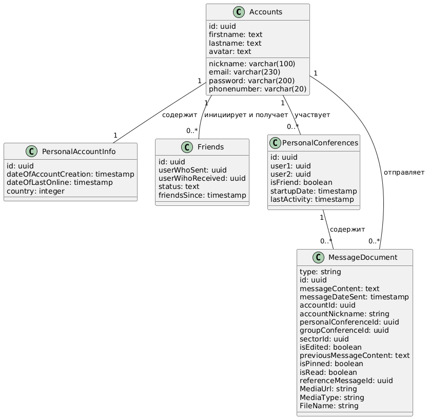
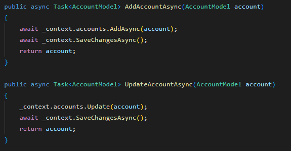
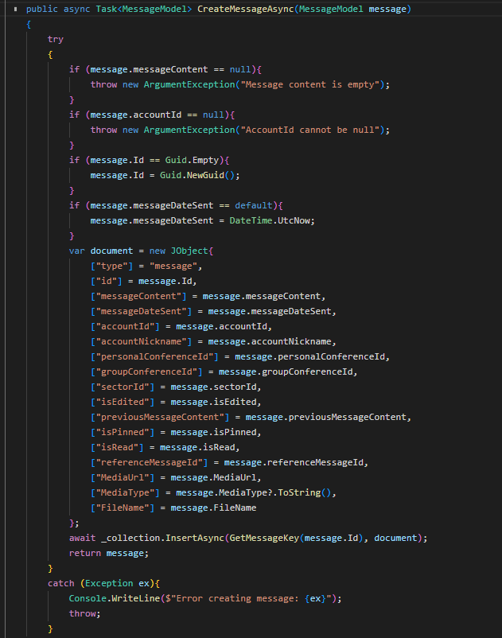
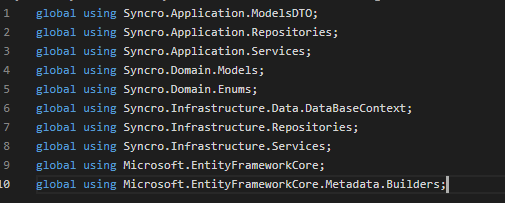
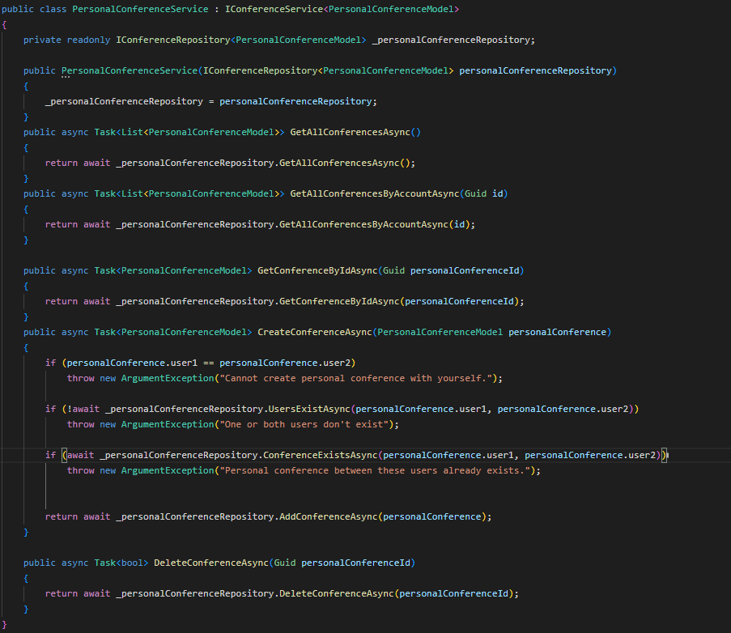

# Диаграмма контейнеров


## Диаграмма компонентов Backend API для персональной информации


## Диаграмма компонентов Backend API для серверов/групп пользователей


## Диаграмма компонентов Backend API для сообщений


# Диаграмма последовательностей


Вариант использования - создание персональной конференции и отправка сообщения пользователем 1 пользователю 2
Пользователь в клиентской части приложения - веб-интерфейсы в списке друзей/пользователей выбирает пользователя №2, нажимает на него, после чего отправляется запрос на сервер с целью проверки - есть ли между пользователями уже конференция, рассматриваем случай когда ее нет(в противном случае просто берется id конференции по id пользователей участвующих в ней) - в таком случае отправляется запрос на сервер с целью создания конференции между 2 пользователями по id, дальше пользователь имеет возможность отправить сообщение другому пользователю(текстовое, с медиа-файлом, с любым другим файлом) - он отправляет запрос на создание сообщения, система его обрабатывает, создает в NoSQL бд сообщение и далее происходит аналогичная отправка через Signalr уведомлений пользователям о появлении нового сообщения в диалоге, после чего происходит отображение у обоих пользователей новового сообщения.

# Диаграмма баз данных в uml


В данной диаграмме представлена часть системы - персональная информация и сообщения. В данный момент сообщения вынесены в NoSQL базу в облаке, но, чтобы набрать 5 сущностей и так как она участвует в варианте использования выше было принято представить ее в данной схеме.
Сущности:
* Accounts - содержит всю информацию об аккаунте пользователя, пароль в хэшированном виде
* Friends - содержит заявки в друзья с сохранением статуса текущей заявки - принято, отклонено, ожидание
* PersonaAccountInfo - содержит информацию о персональной информации пользователя, которую в будущем планируется скрыть, но которая может быть нужна при желании пользователя - страна, даты захода, создания аккаунта
* PersonalConferences - содержит информацию о созданной между 2 пользователями персональной конференции - она может быть только 1, может быть открыта как между друзьями, так и между просто пользователями системы
* Messages - вынесенная в NoSQL Couchbase структура, содержащая сообщения, которые в будущем будут зашифрованы AES-256, а так же всю информацию о статусе сообщения - прочтено, закреплено..

# Принципы разработки
## KISS


Данный код на уровне репозитория используется везде. Код прост, вся логика вынесена на уровень сервиса - основная задача репозитория работа с БД, следовательно ничего лишнего кроме выполнения CRUD.
## YAGNI


Данный код отвечает только за функции необходимые для MVP, мы не проверяем на неподобающий контент, нецензурную лексику и тд, ввиду ненадобности на данном этапе, если будет надо в будущем - будет сделано.
## DRY


Повторяющийся код - использование using вынесено в глобальный файл GlobalUsing, который распространяется на весь проект и добавляет директиву using каждому объекту .cs, вместо написания одинакового кода каждый раз в верхней части файла
## SOLID


* Single responsibility: только работа с персональными конференциями, не смешивает логику сообщений, пользователей..
* Open-closed: можно создать GroupConferenceService с тем же интерфейсом, без изменения существующего кода.
* Liskov substitution: может использоваться везде, где ожидается IConferenceService<T>, корректно реализует все методы интерфейса.
* Interface segregation: узконаправленные методы только для конференций, других нет
* Dependency inversion:
    ```Csharp
    public PersonalConferenceService(
    IConferenceRepository<PersonalConferenceModel> personalConferenceRepository)
    {
        _personalConferenceRepository = personalConferenceRepository;
    }
    ```
    _personalConferenceRepository = personalConferenceRepository; - Зависит от абстракции - интерфейса, а не от конкретной реализации.

# Дополнительные принципы

## BDUF (Big Design Up Front) - отказ
Проект ограничен жесткими временными рамками (5 месяцев) и минимальным бюджетом - полное предварительное проектирование заняло бы слишком много времени, в то время как веб-приложения с видео-коммуникацией требуют постоянных экспериментов и адаптации, особенно с WebRTC. Единственный разработчик должен быстро получать обратную связь от работающего кода, а не от документов, при этом ему критически важно выпустить работающий продукт как можно раньше.

Однако элементы BDUF присутствуют:

* Архитектура баз данных спроектирована заранее
* Выбраны и исследованы ключевые технологии (SignalR, WebRTC, Couchbase)
* Определены интеграционные точки (Steam API, Yandex Calendar)

## SoC (Separation of Concerns) - применение
Архитектурное разделение:

Клиент (React/TypeScript) - Бэкенд (.NET) - Базы данных

Отдельные микросервисы для разных функций (видео, сообщения, уведомления)

Слоистая архитектура на данный момент:

Controller - Service - Repository - Database
* Контроллеры - обработка HTTP-запросов
* Сервисы - бизнес-логика
* Репозитории - доступ к бд
* Модели - entities - сущности

Разделение хранилищ данных:

1) PostgreSQL - структурированные данные (пользователи, конференции..)
2) Couchbase - неструктурированные данные (сообщения)
3) Selectel S3 - медиафайлы

## MVP (Minimum Viable Product) - применение

MVP четко определен в требованиях:

* Регистрация/авторизация
* Личные и групповые чаты с сообщениями
* Базовые видео-звонки (1 на 1)
* Обмен медиафайлами

Что исключено из MVP:

Совместный просмотр видео (кинотеатр), рекомендации из Steam/EGS, высокая нагрузка (>100 пользователей), серверная система как в Discord.

Приоритеты MVP:

1. Работающий чат (текст + медиа), система авторизации, добавление друзей
2. Базовые видео-звонки и голосовые звонки + демонстрация экрана в персональных конференциях
3. Шифрование сообщений
4. Выдерживание нагрузки в 100 одновременных пользователей

Критерии успеха MVP включают стабильную работу основных определенных функций mvp, а также успешную демонстрацию их комиссии

