# Документация API для приложения Syncro 

## Принятые проектные решения

### Исходные данные и их описание

Рассмотрим принятые проектные решения для сервиса персональной информации на Backend. Диаграмма компонентов представлена далее:

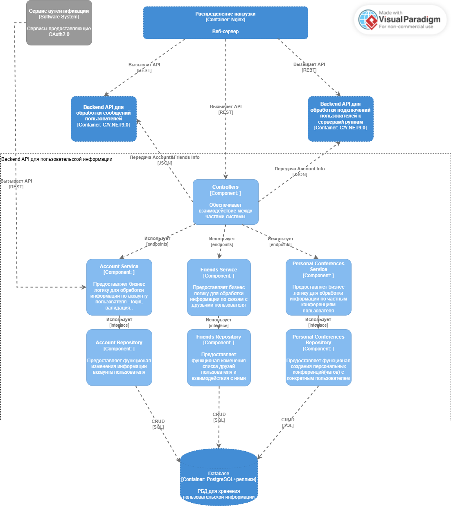

В данном случае нас интересует компонент controllers

В .NET controllers играют ключевую роль в архитектуре приложения, выступая в качестве HTTP-обработчиков. Они отвечают за

* сопоставление входящих HTTP-запросов с конкретными методами действия на основе маршрутов
* проверку корректности данных, полученных в запросах
* обработку HTTP-методов - реализацию эндпоинтов для GET, POST, PUT, DELETE...
* управление жизненным циклом запроса - организацию потока выполнения включающего авторизацию, обработку, формирование ответов
* вызов бизнес-логики через инжектированные сервисы
* формирование HTTP-ответов - создание соответствующих HTTP-статусов, заголовков и тел ответов
* обработку исключений - перехват и преобразование исключений в соответствующие HTTP-статусы

Рассмотрим вызовы для сущностей и связанных с ними сервисов и репозиториев Accounts и Personal Conferences.

### Описание API для Accounts

1. GET: api/accounts/{email}/get

   Описание: Получение всей модели Account без пароля и id. Цель - получать по e-mail данные пользователя для сброса пароля и для восстановления доступу к аккаунту посредством отправки письма на почту при существовании аккаунта / для других целей в самом приложении, так как e-mail уникальная сущность для каждого пользователя.

   Реализация:
   ```csharp
   [HttpGet("{email}/get")]
        public async Task<ActionResult<AccountNoPasswordModel>> GetAccountByEmail(string email)
        {
            try
            {
                var account = await _accountService.GetAccountByEmailAsync(email);
                var accountNoPassword = TranferModelsMapper.AccountNoPasswordModelMapMapper(account);
                return Ok(accountNoPassword);
            }
            catch (ArgumentException ex)
            {
                return StatusCode(404, $"Account not found error: {ex.Message}");
            }
            catch (Exception ex)
            {
                return StatusCode(500, $"Internal server error: {ex.Message}");
            }
        }
   ```
   Отправляемые данные:
   
   ```csharp
     {
    "email": "string" // required
    }
   ```
   Ожидаемый ответ(body):
   
   200 OK:
   
   ```csharp
     {
    "nickname": "string",
    "email": "string",
    "firstname": "string",
    "lastname": "string",
    "phonenumber": "string",
    "avatar": "string",
    "avatarFile": "string"
    }
   ```
   #### Возможные ответы при ошибке и тесты:
   
   Headers:
   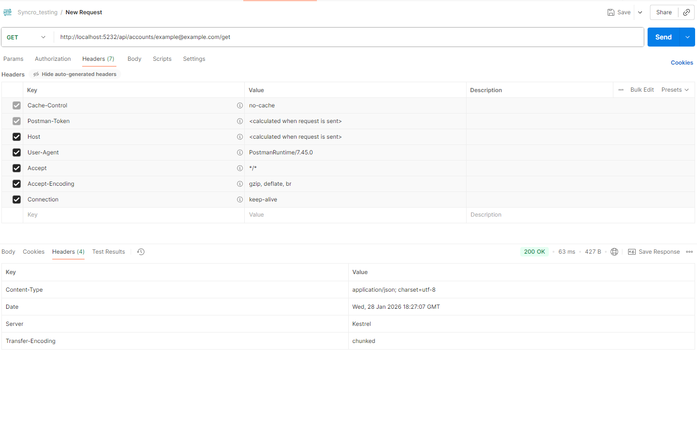
   * 200, здесь тело выше
   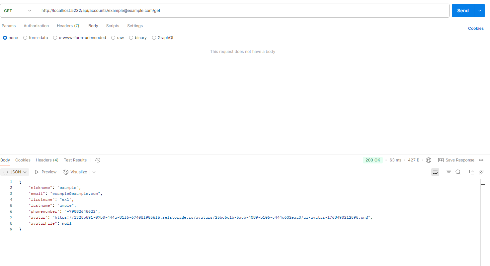
   * 404, $"Account not found error: {ex.Message}" - аккаунт не найден при поиске
   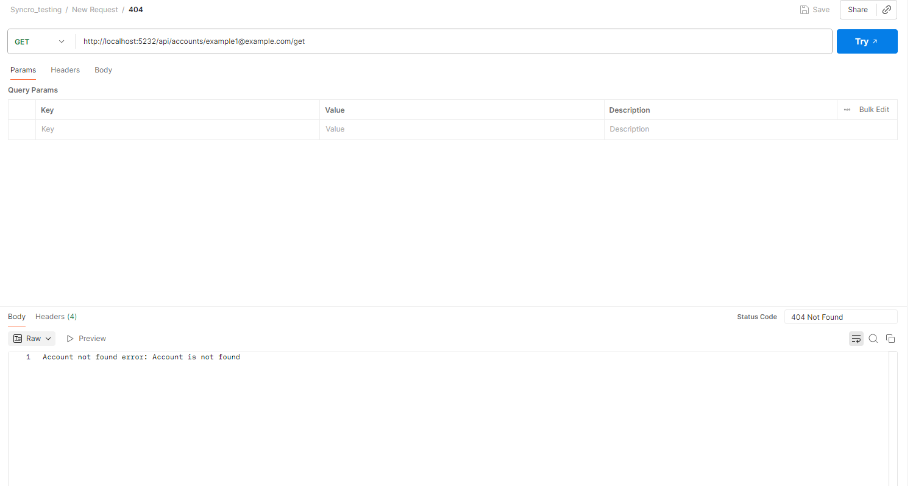
   * 500, $"Internal server error: {ex.Message}" - ошибка со стороны сервера
    
2. POST: api/accounts
   
   Описание: Создание сущности Account после регистрации пользователя в окне register по представленной ниже модели

   Модель:
   
   ```csharp
     public Guid Id { get; set; }
     public required string nickname { get; set; }
     public string? email { get; set; }
     public required string password { get; set; }
     public string? firstname { get; set; }
     public string? lastname { get; set; }
     public string? phonenumber { get; set; }
     public string? avatar { get; set; }
   ```

   Реализация:
   ```csharp
   [HttpPost]
        public async Task<ActionResult<AccountNoPasswordModel>> CreateAccount([FromBody] AccountModel account)
        {
            try
            {
                var createdAccount = await _accountService.CreateAccountAsync(account);
                var createdAccountNoPassword = TranferModelsMapper.AccountNoPasswordModelMapMapper(createdAccount);
                var createdPersonalAccountInfo = await _infoService.CreatePersonalAccountInfoAsync(account.Id);
                return CreatedAtAction(nameof(GetAccountById), new { id = createdAccount.Id }, createdAccountNoPassword);
            }
            catch (ConflictException ex)
            {
                return StatusCode(409, new
                {
                    success = false,
                    error = "Conflict",
                    message = ex.Message
                });
            }
            catch (ArgumentException ex)
            {
                return StatusCode(400, new
                {
                    success = false,
                    error = "Validation error",
                    message = ex.Message
                });
            }
            catch (Exception ex)
            {
                return StatusCode(500, new
                {
                    success = false,
                    error = "Internal server error",
                    message = "An unexpected error occurred"
                });
            }
        }
   ```

   Отправляемые данные:
   
   ```csharp
     {
    "id": "Guid", //required
    "nickname": "string", //required
    "email": "string", //required
    "password": "string", //required
    "firstname": "string",
    "lastname": "string",
    "phonenumber": "string", //required
    "avatar": "string"
    }
   ```
   Ожидаемый ответ(body):
   
   200 OK:
   
   ```csharp
     {
      "nickname": "string",
      "email": "string",
      "firstname": "string",
      "lastname": "string",
      "phonenumber": "string",
      "avatar": "string",
      "avatarFile": "string"
    }
   ```
   #### Возможные ответы при ошибке и тесты:
   
   Headers:
   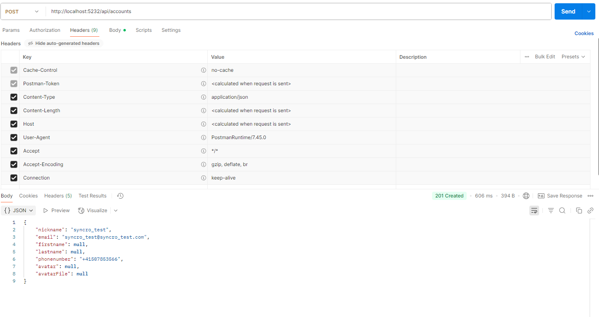
   
   * 200, здесь тело выше
   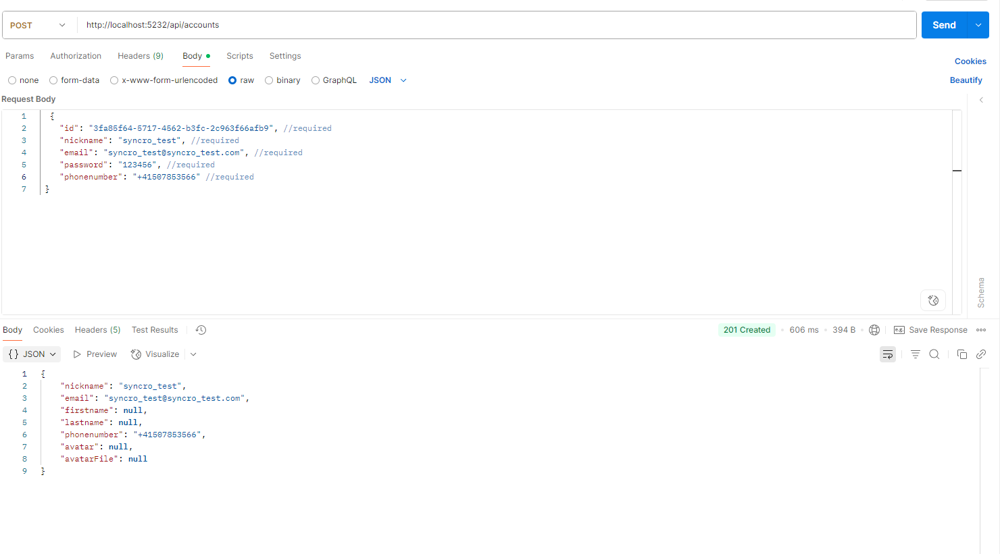
   * 409, $"Conflict" (при создании с nickname/email/phonenumber который уже существует
   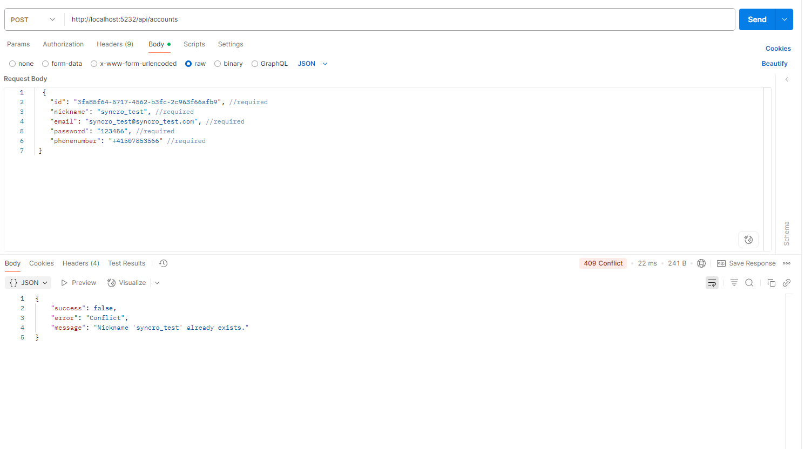
   * 400, $"Validation error" - ошибка при валидации входных данных
   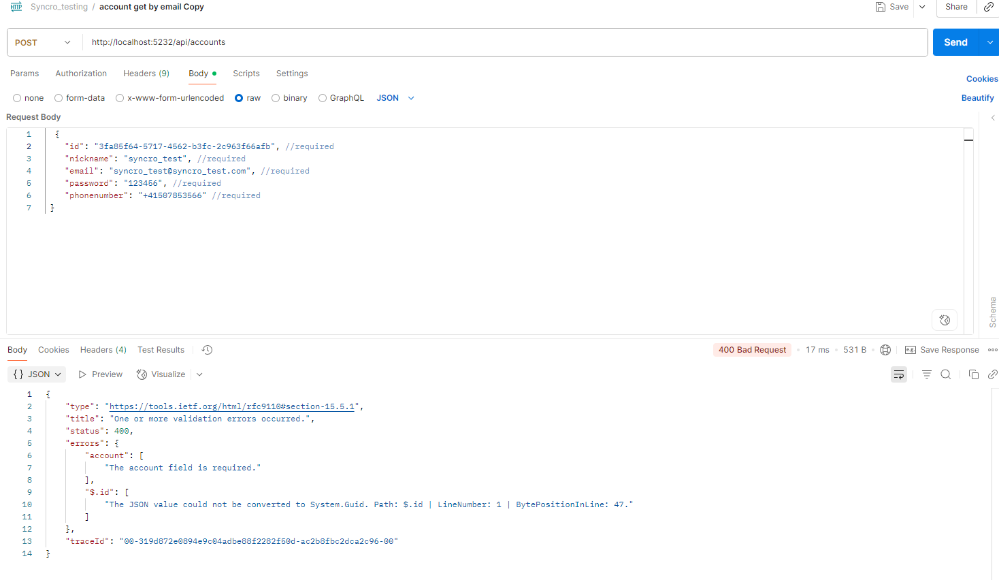
   * 500, $"Internal server error" - внутренняя ошибка сервера

3. POST: api/accounts/login
   
   Описание: Эндпоинт отвечает за выдачу пользователю jwt для дальнейшей его идентификации в приложении, а так же в тестовом(пока) режиме выдает пользователю cookie в котором и содержится jwtoken.

   Модель:
   ```csharp
   [Required(ErrorMessage = "Email is required")]
   [EmailAddress(ErrorMessage = "Invalid email format")]
   public string Email { get; set; }

   [Required(ErrorMessage = "Password is required")]
   [MinLength(6, ErrorMessage = "Password must be at least 6 characters")]
   public string Password { get; set; }
   ```
   Реализация:

   ```csharp
   [HttpPost("login")]
        public async Task<IActionResult> Login([FromBody] Application.ModelsDTO.LoginRequest request)
        {
            if (!ModelState.IsValid)
            {
                return StatusCode(400, $"Bad request error: {ModelState}");
            }
            try
            {
                var result = await _accountService.Login(request.Email, request.Password);

                if (result.IsSuccess)
                {
                    HttpContext.Response.Cookies.Append("access-token", result.Value, new CookieOptions
                    {
                        HttpOnly = true,
                        Secure = true,
                        SameSite = SameSiteMode.Strict
                    });
                    return Ok(new { Message = "Logged in successfully" });
                }
                return StatusCode(401, $"User unauthorized error: {result.Error}");
            }
            catch (Exception)
            {
                return StatusCode(404, $"Аккаунт с таким email не найден");
            }
        }
   ```

   Отправляемые данные:
   
   ```csharp
     {
      "email": "string",
      "password": "string"
    }
   ```
   Ожидаемый ответ(body):
   
   200 OK + выдача в cookie jwtoken
   
   #### Возможные ответы при ошибке и тесты:

   Headers:
   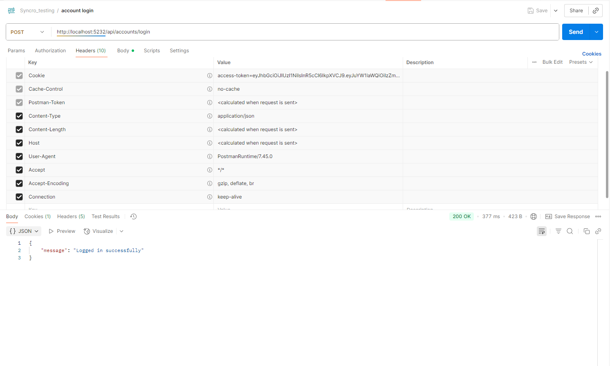
   
   * 200, выдача в cookie jwtoken
   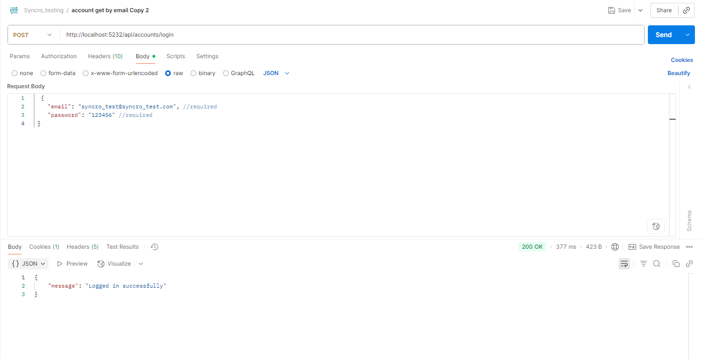
   * 400, $"Bad request error: {ModelState}" - ошибка при создании токена
   * 401, $"User unauthorized error: {result.Error}" - если пользователь неавторизован
   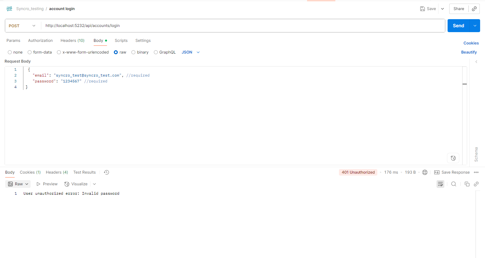
   * 404, $"Аккаунт с таким email не найден") - если введенный e-mail не найден в базе
   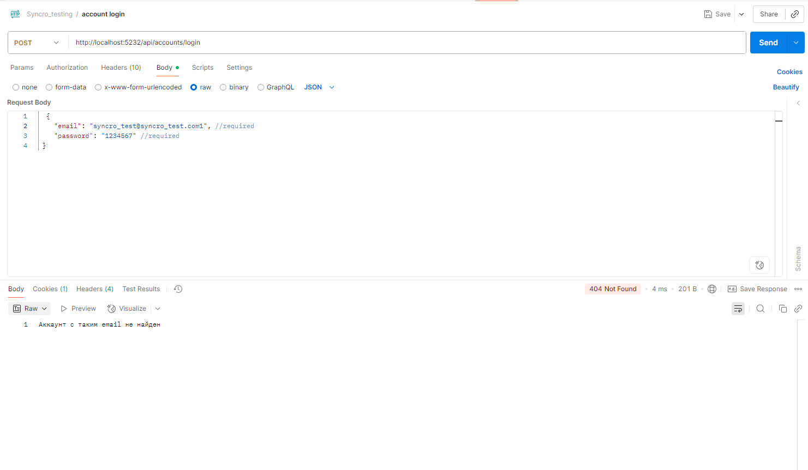

4. PUT: api/accounts/{id}
   
   Описание: Обновление уже существующей сущности Accounts при обновленни данных пользователем в его настройках профиля

   Модель:
   
   ```csharp
     public required string nickname { get; set; }
     public string? email { get; set; }
     public required string password { get; set; }
     public string? firstname { get; set; }
     public string? lastname { get; set; }
     public string? phonenumber { get; set; }
     public string? avatar { get; set; }
   ```

   Реализация:
   ```csharp
   [HttpPut("{id}")]
        public async Task<IActionResult> UpdateAccount(Guid id, [FromBody] AccountModelDTO accountDto)
        {
            try
            {
                var updatedAccount = await _accountService.UpdateAccountAsync(id, accountDto);
                return Ok(updatedAccount);
            }
            catch (KeyNotFoundException ex)
            {
                return StatusCode(404, $"Account not found error: {ex.Message}");
            }
            catch (ArgumentException ex)
            {
                return StatusCode(400, $"Bad request error: {ex.Message}");
            }
            catch (Exception ex)
            {
                return StatusCode(500, $"Internal server error: {ex.Message}");
            }
        }
   ```

   Отправляемые данные:
   
   ```csharp
     {
    "id": "Guid", //required
    //Body ниже
    "nickname": "string", //required
    "email": "string", //required
    "password": "string", //required
    "firstname": "string",
    "lastname": "string",
    "phonenumber": "string", //required
    "avatar": "string"
    }
   ```
   Ожидаемый ответ(body):
   
   200 OK
   
   #### Возможные ответы при ошибке и тесты:

   Headers:
   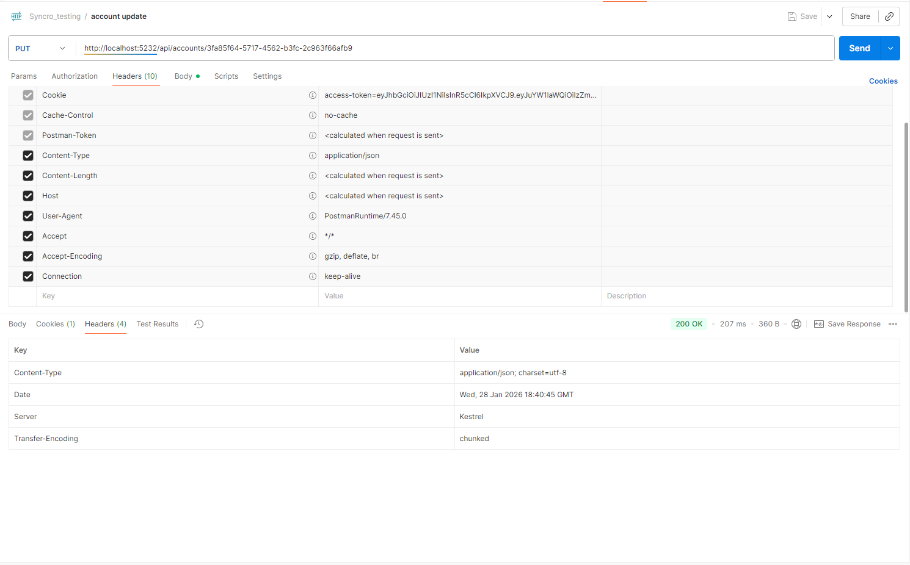
   
   * 200, сущность успешно обновлена
   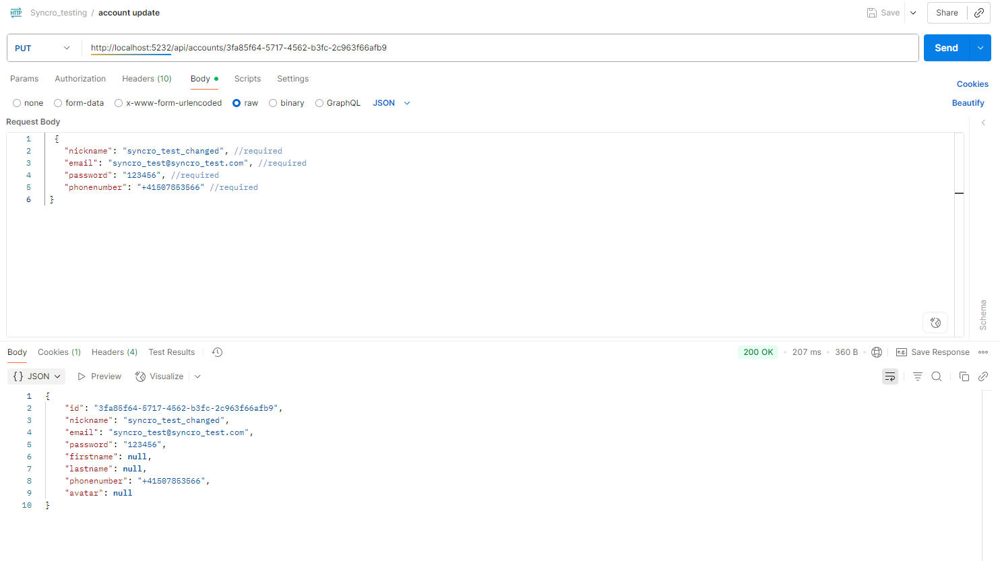
   * 404, $"Account not found error: {ex.Message}" - аккаунт не найден
   * 400, $"Bad request error" - ошибка при обновлении на уровне сервиса
   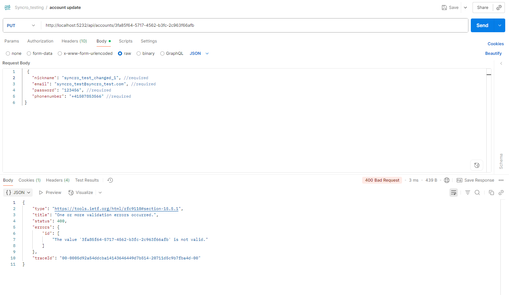
   * 500, $"Internal server error" - внутренняя ошибка сервера
   
### Описание API для Personal Conferences

1. GET: /api/personalconference/{id}/getbyaccount

   Описание: Получение по id пользователя всех персональных конференций в которых он участвует. Нужно для переходов и отображения чатов в которые пользователь может попасть и в которых он когда-либо вел/планирует вести переписку

   Реализация:
   ```csharp
   [HttpGet("{id}/getbyaccount")]
        public async Task<ActionResult<IEnumerable<PersonalConferenceModel>>> GetAllPersonalConferencesByAccount(Guid id)
        {
            try
            {
                var personalConferences = await _personalConferenceService.GetAllConferencesByAccountAsync(id);
                return Ok(personalConferences);
            }
            catch (Exception ex)
            {
                return StatusCode(500, $"Internal server error: {ex.Message}");
            }
        }
   ```

   Отправляемые данные:
   
   ```csharp
     {
    "id": "Guid", //required
    }
   ```
   Ожидаемый ответ(body, множественный вариант):
   
   200 OK:
   
   ```csharp
     {
      "id": Guid,
      "user1": Guid,
      "user2": Guid,
      "isFriend": bool,
      "startingDate": DateTimeOffset,
      "lastActivity": DateTimeOffset
    }
   ```
   #### Возможные ответы при ошибке и тесты:

   Headers:
   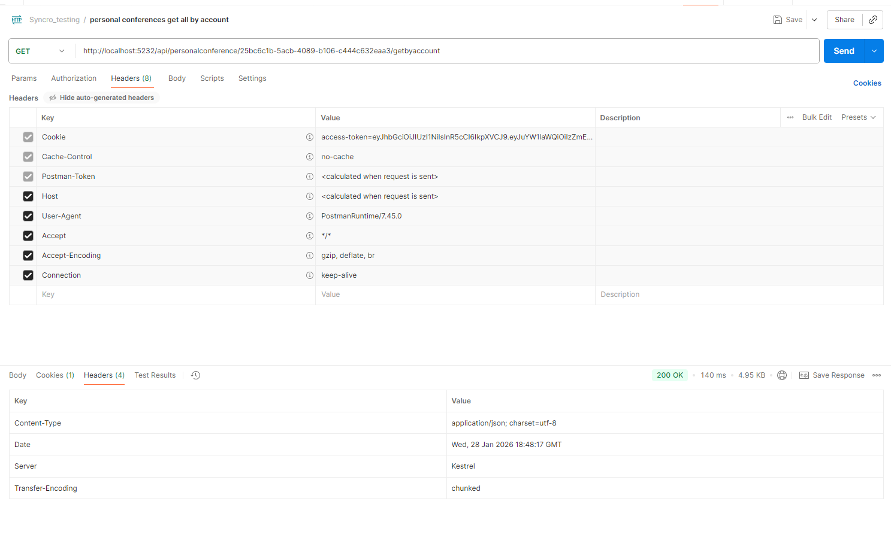

   * 200, здесь тело выше
   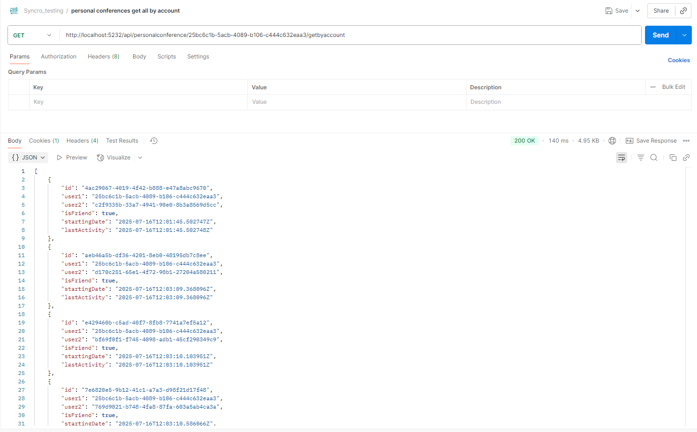
   * 400 - ошибка валидации
   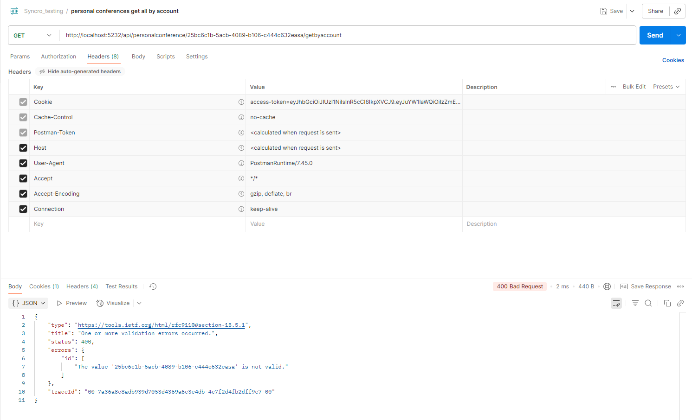
   * 500, $"Internal server error" - внутренняя ошибка сервера

2. POST: api/personalconference
   
   Описание: Создание сущности PersonalConference после нажатия пользователя по пользователю с которым он хочет завести переписку - при этом оба пользователя через SignalR уведомляются о начале новой переписки и у обоих появляется новая переписка.

   Модель:
   
   ```csharp
        public Guid Id { get; set; }
        public Guid user1 { get; set; }
        public Guid user2 { get; set; }
        public bool isFriend { get; set; }
        public DateTime startingDate { get; set; }
        public DateTime lastActivity { get; set; }
   ```

   Реализация:
   ```csharp
   [HttpPost]
        //[Authorize]
        public async Task<ActionResult<PersonalConferenceModel>> CreatePersonalConference(
        [FromBody] PersonalConferenceModel conference)
        {
            try
            {
                var result = await _personalConferenceService.CreateConferenceAsync(conference);
                await _messagesHub.Clients.Users(conference.user1.ToString(), conference.user2.ToString()).SendAsync("PersonalConferenceCreated", result);
                return CreatedAtAction(nameof(GetPersonalConferenceById), new { id = result.Id }, result);
            }
            catch (ArgumentException ex)
            {
                return StatusCode(400, $"Bad request error: {ex.Message}");
            }
            catch (Exception ex)
            {
                return StatusCode(500, $"Internal server error: {ex.Message}");
            }
        }
   ```

   Отправляемые данные:
   
   ```csharp
     {
      "id": Guid,
      "user1": Guid,
      "user2": Guid,
      "isFriend": bool,
      "startingDate": DateTimeOffset,
      "lastActivity": DateTimeOffset
    }
   ```
   Ожидаемый ответ(body):
   
   200 OK:
   
   ```csharp
     {
      "id": Guid,
      "user1": Guid,
      "user2": Guid,
      "isFriend": bool,
      "startingDate": DateTimeOffset,
      "lastActivity": DateTimeOffset
    }
   ```
   #### Возможные ответы при ошибке и тесты:
   
   Headers:
   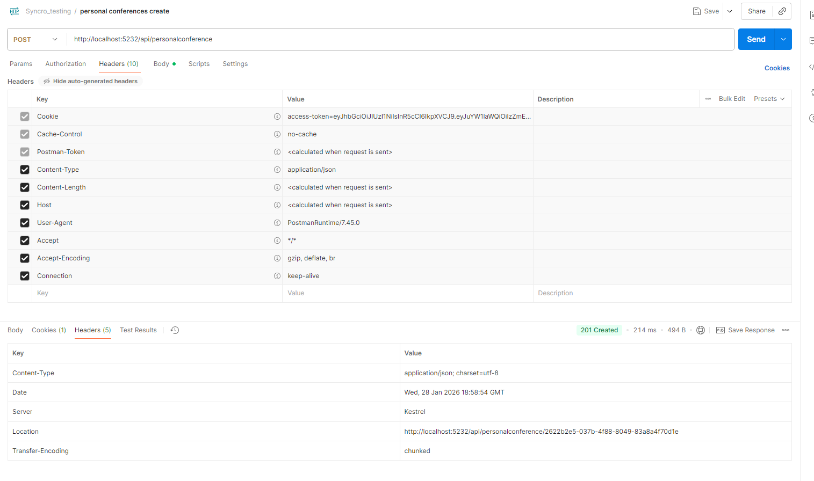
   
   * 200, здесь тело выше
   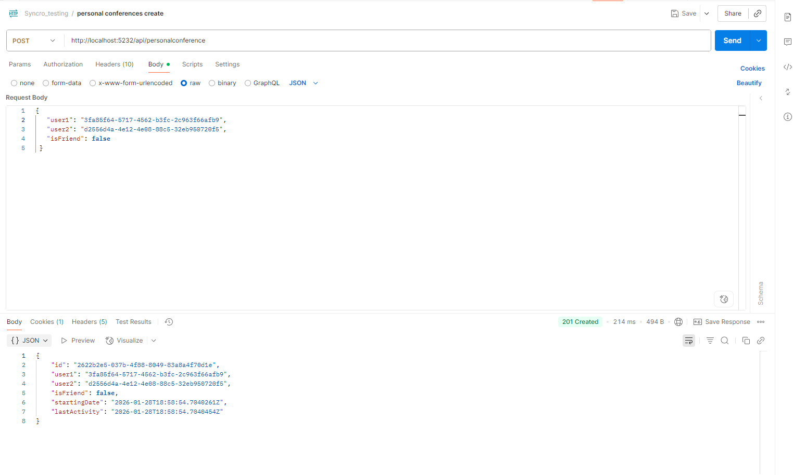
   * 400, $"Bad request error: {ex.Message}" - ошибка при создании конференции
   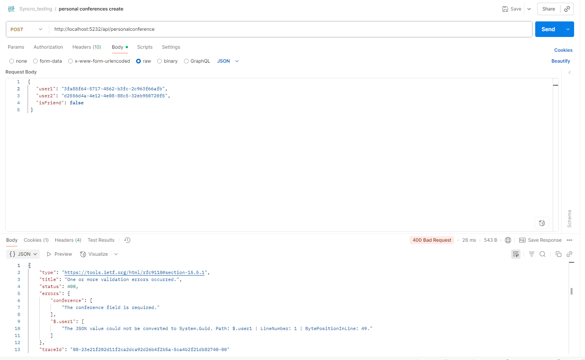
   * 409, $"Conflict: {ex.Message}" - конференция уже существует между этими пользователями
   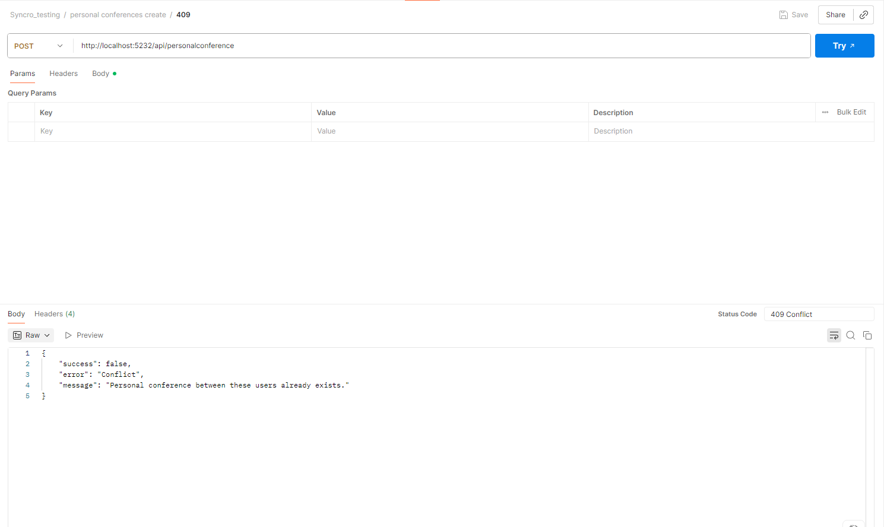
   * 500, $"Internal server error" - внутренняя ошибка сервера

3. GET: /api/personalconference
   
   Описание: Получение вообще всех персональных конференций между пользователями в списке для разработчика.

   Реализация:
   ```csharp
   [HttpGet]
        public async Task<ActionResult<IEnumerable<PersonalConferenceModel>>> GetAllPersonalConferences()
        {
            try
            {
                var personalConferences = await _personalConferenceService.GetAllConferencesAsync();
                return Ok(personalConferences);
            }
            catch (Exception ex)
            {
                return StatusCode(500, $"Internal server error: {ex.Message}");
            }
        }
   ```

   Отправляемые данные:
   
   Просто отправляется запрос
   
   Ожидаемый ответ(body, весь список):
   
   200 OK:
   
   ```csharp
     {
      "id": Guid,
      "user1": Guid,
      "user2": Guid,
      "isFriend": bool,
      "startingDate": DateTimeOffset,
      "lastActivity": DateTimeOffset
    }
   ```
   #### Возможные ответы при ошибке и тесты:

   Headers:
   
   
   * 200, здесь тело выше
   
   * 500, $"Internal server error" - внутренняя ошибка сервера

4. DELETE: api/personalconferences/{id}
   
   Описание: Удаление сущности PersonalConference при желании одним из участников переписки
   
   Реализация:
   ```csharp
   [HttpDelete("{id}")]
        //[Authorize]
        public async Task<IActionResult> DeletePersonalConference(Guid id)
        {
            try
            {
                var result = await _personalConferenceService.DeleteConferenceAsync(id);
                if (!result)
                {
                    return StatusCode(404, $"Personal Conference not found error: ID {id}");
                }
                return NoContent();
            }
            catch (Exception ex)
            {
                return StatusCode(500, $"Internal server error: {ex.Message}");
            }
        }
   ```

   Отправляемые данные:
   
   ```csharp
     {
      "id": Guid //required
    }
   ```
   Ожидаемый ответ(body):
   
   200 OK
   
   #### Возможные ответы при ошибке и тесты:

   Headers:
   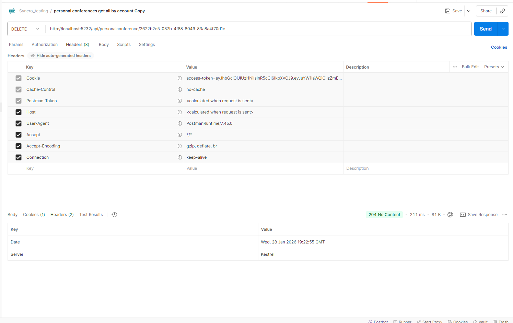

   * 200, успешное удаление
   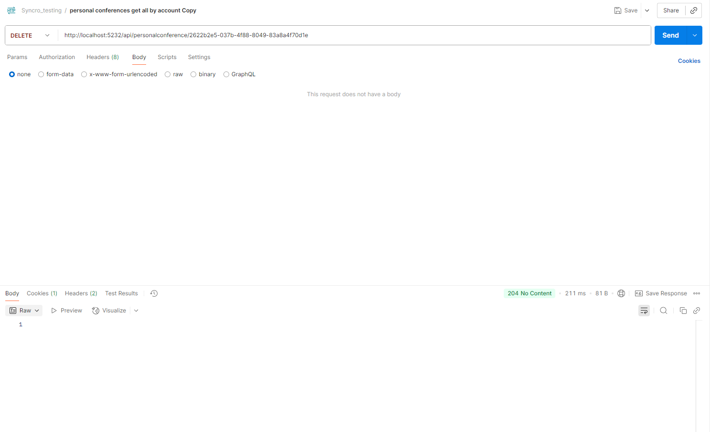
   * 404, $"Personal Conference not found error: ID {id}" - конференция для удаления не найдена
   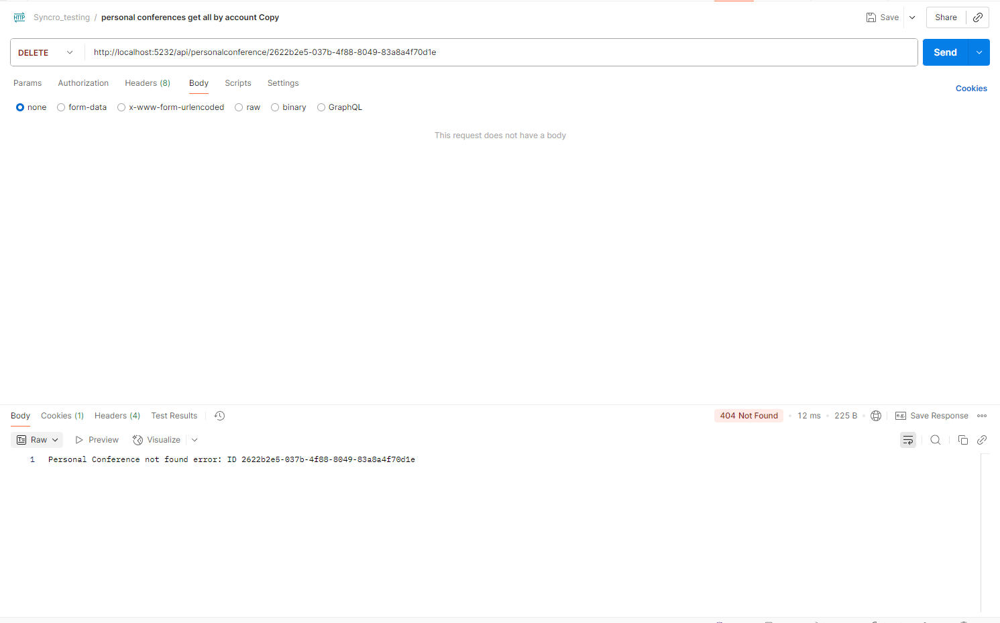
   * 500, $"Internal server error" - внутренняя ошибка сервера
