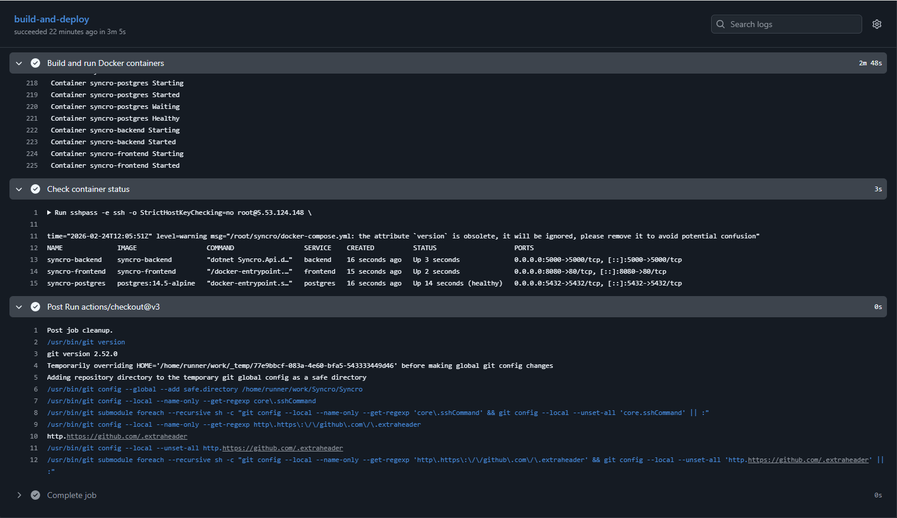
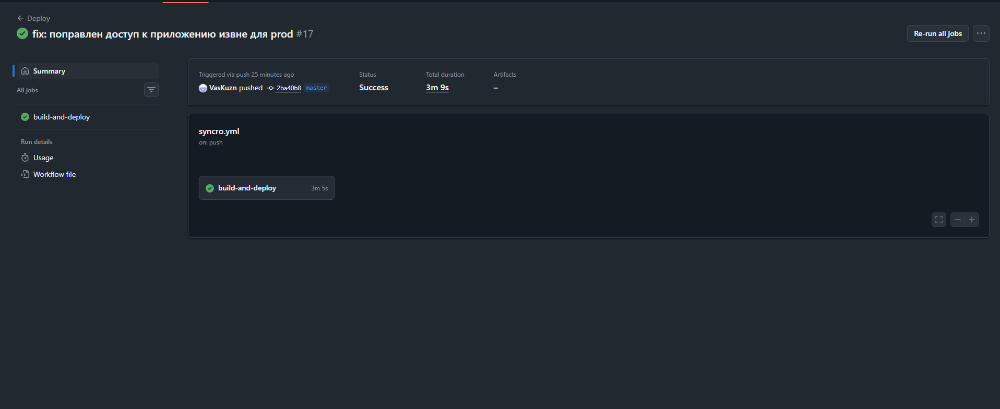
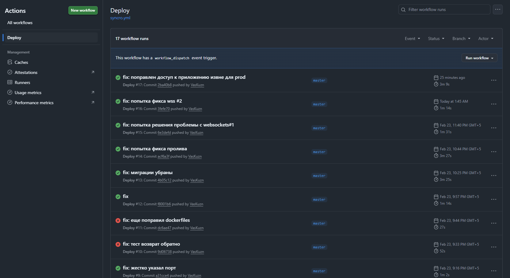

# Лабораторная работа №5
## Реализация архитектуры на основе сервисов (микросервисной архитектуры)

### Принятые проектные решения

В рамках лабораторной работы реализовано приложение Syncro - платформа для обмена сообщениями. На основе диаграммы контейнеров выделены три основных компонента:
* Клиентская часть (Frontend) - React приложение на Node.js
* Серверная часть (Backend) - ASP.NET Core Web API
* База данных (Database) - PostgreSQL

### Взаимодействие между сервисами организовано следующим образом:
* Frontend → Backend: HTTP/HTTPS запросы через API и WebSocket соединения для real-time сообщений
* Backend → Database: прямое подключение к PostgreSQL для хранения данных
* Все сервисы изолированы в отдельной Docker-сети для безопасного взаимодействия

## Реализация контейнеров:

### Frontnend dockerfile:
```dockerfile
FROM node:23.8.0-alpine AS build

ARG VITE_API_URL
ARG VITE_ENVIRONMENT
ARG VITE_USE_HTTPS
ARG VITE_WS_URL

ENV VITE_API_URL=$VITE_API_URL \
    VITE_ENVIRONMENT=$VITE_ENVIRONMENT \
    VITE_USE_HTTPS=$VITE_USE_HTTPS \
    VITE_WS_URL=$VITE_WS_URL

WORKDIR /app

COPY package*.json ./
RUN npm ci --legacy-peer-deps
COPY . .
RUN npm run build:prod

# Frontend serve stage with Nginx
FROM nginx:1.25-alpine

RUN rm /etc/nginx/conf.d/default.conf
COPY nginx.conf /etc/nginx/conf.d/default.conf
COPY --from=build /app/dist /usr/share/nginx/html

EXPOSE 80

CMD ["nginx", "-g", "daemon off;"]
```
Здесь устанавливаются переменные окружения, подгружается установленная ранее версия NODE подгружается конфиг nginx и указывается рабочая директория + запускается сборка 

### Backend dockerfile:
```dockerfile
# Backend build stage
FROM mcr.microsoft.com/dotnet/sdk:9.0 AS build

WORKDIR /src

COPY ["Syncro.Server/Syncro.Api/Syncro.Api.csproj", "Syncro.Api/"]
COPY ["Syncro.Server/Syncro.Application/Syncro.Application.csproj", "Syncro.Application/"]
COPY ["Syncro.Server/Syncro.Infrastructure/Syncro.Infrastructure.csproj", "Syncro.Infrastructure/"]
COPY ["Syncro.Server/Syncro.Domain/Syncro.Domain.csproj", "Syncro.Domain/"]

RUN cd Syncro.Api && dotnet restore

COPY Syncro.Server/ .

WORKDIR "/src/Syncro.Api"
RUN dotnet publish -c Release -o /app/publish

# Backend runtime stage
FROM mcr.microsoft.com/dotnet/aspnet:9.0

WORKDIR /app

COPY --from=build /app/publish .

EXPOSE 5000

ENV ASPNETCORE_URLS=http://+:5000
ENV ASPNETCORE_ENVIRONMENT=Production

ENTRYPOINT ["dotnet", "Syncro.Api.dll"]
```
Здесь из SDK .NET собирается приложение - указываются слои и откуда и куда они копируются, открывается 5000 порт для backend, а также устанавливается переменная Production

### Nginx configuration:
```nginx
server {
    listen 80;
    server_name _;

    root /usr/share/nginx/html;
    index index.html;

    # Serve static files with cache
    location ~* \.(js|css|png|jpg|jpeg|gif|ico|svg|woff|woff2|ttf|eot)$ {
        expires 365d;
        add_header Cache-Control "public, immutable";
    }

    # Proxy API requests to backend
    location /api/ {
        proxy_pass http://backend:5000;
        proxy_http_version 1.1;
        proxy_set_header Upgrade $http_upgrade;
        proxy_set_header Connection 'upgrade';
        proxy_set_header Host $host;
        proxy_set_header X-Real-IP $remote_addr;
        proxy_set_header X-Forwarded-For $proxy_add_x_forwarded_for;
        proxy_set_header X-Forwarded-Proto $scheme;
        proxy_cache_bypass $http_upgrade;
    }

    # Proxy WebSocket connections
    location ~ /hub {
        proxy_pass http://backend:5000;
        proxy_http_version 1.1;
        proxy_set_header Upgrade $http_upgrade;
        proxy_set_header Connection "upgrade";
        proxy_set_header Host $host;
        proxy_set_header X-Real-IP $remote_addr;
        proxy_set_header X-Forwarded-For $proxy_add_x_forwarded_for;
        proxy_set_header X-Forwarded-Proto $scheme;
    }

    # SPA routing - all requests to index.html except API
    location / {
        try_files $uri $uri/ /index.html;
    }
}
```
Здесь указываются настройки веб-сервера - проксирование и настройки для конкретных путей(например websockets)

### docker compose и postgres:
```dockerfile
version: '3.9'

services:
  postgres:
    image: postgres:14.5-alpine
    container_name: syncro-postgres
    environment:
      POSTGRES_DB: ${DB_NAME:-SyncroDB}
      POSTGRES_USER: ${DB_USER:-postgres}
      POSTGRES_PASSWORD: ${DB_PASSWORD:-postgres}
    ports:
      - "${DB_PORT:-5432}:5432"
    volumes:
      - postgres_data:/var/lib/postgresql/data
    healthcheck:
      test: ["CMD-SHELL", "pg_isready -U ${DB_USER:-postgres}"]
      interval: 10s
      timeout: 5s
      retries: 5
    networks:
      - syncro-network

  backend:
    build:
      context: .
      dockerfile: Syncro.Server/Syncro.Api/Dockerfile
    container_name: syncro-backend
    environment:
      ASPNETCORE_ENVIRONMENT: ${ASPNETCORE_ENVIRONMENT:-Production}
      ConnectionStrings__DefaultConnection: "Host=postgres;Database=${DB_NAME:-SyncroDB};Username=${DB_USER:-postgres};Password=${DB_PASSWORD:-postgres}"
      JWTOptions__SecretKey: ${JWT_SECRET_KEY}
      JWTOptions__ExpiresHours: ${JWT_EXPIRES_HOURS:-12}
      S3Storage__ServiceURL: ${S3_SERVICE_URL}
      S3Storage__AccessKey: ${S3_ACCESS_KEY}
      S3Storage__SecretKey: ${S3_SECRET_KEY}
      S3Storage__BucketName: ${S3_BUCKET_NAME}
      S3Storage__Region: ${S3_REGION}
      S3Storage__CdnUrl: ${S3_CDN_URL}
      S3Storage__UrlExpirationHours: ${S3_URL_EXPIRATION_HOURS:-24}
      Couchbase__Endpoint: ${COUCHBASE_ENDPOINT}
      Couchbase__Username: ${COUCHBASE_USERNAME}
      Couchbase__Password: ${COUCHBASE_PASSWORD}
      Couchbase__BucketName: ${COUCHBASE_BUCKET_NAME}
      Couchbase__ScopeName: ${COUCHBASE_SCOPE_NAME}
      Couchbase__CollectionName: ${COUCHBASE_COLLECTION_NAME}
      Email__EmailAddress: ${EMAIL_ADDRESS}
      Email__EmailPseudonim: ${EMAIL_PSEUDONYM}
      Email__EmailToken: ${EMAIL_TOKEN}
      Email__EmailServer: ${EMAIL_SERVER}
      Email__EmailPort: ${EMAIL_PORT}
      Frontend_Url__Url: ${FRONTEND_URL:-https://syncro-test.ru}
    ports:
      - "${BACKEND_PORT:-5000}:5000"
    depends_on:
      postgres:
        condition: service_healthy
    networks:
      - syncro-network

  frontend:
    build:
      context: ./Syncro.Client/syncro-frontend
      dockerfile: Dockerfile
      args:
        VITE_API_URL: ${VITE_API_URL:-https://syncro-test.ru}
        VITE_ENVIRONMENT: ${VITE_ENVIRONMENT:-production}
        VITE_USE_HTTPS: ${VITE_USE_HTTPS:-true}
        VITE_WS_URL: ${VITE_WS_URL:-wss://syncro-test.ru}
    container_name: syncro-frontend
    ports:
      - "${FRONTEND_PORT:-80}:80"
    depends_on:
      - backend
    networks:
      - syncro-network

volumes:
  postgres_data:

networks:
  syncro-network:
    driver: bridge
```
Docker compose отвечает за дальнешую окрестрацию контейнеров в приложении, также в нем задается последний 3 контейнер под базу данных, отвечающий за хранение данных пользователей
далее происходит поэтапный build контейнеров с установкой прослушиваемых портов и настройкой переменных окружения

### CI/CD:
```yml
name: Deploy

on:
  push:
    branches:
      - master
  workflow_dispatch:

env:
  SERVER_HOST: 5.53.124.148
  SERVER_USER: root
  SERVER_PATH: /root/syncro

jobs:
  build-and-deploy:
    runs-on: ubuntu-22.04

    steps:
      - uses: actions/checkout@v3

      # Установка sshpass для пароль-based аутентификации
      - name: Install sshpass
        run: sudo apt-get update && sudo apt-get install -y sshpass

      # Копирование кода на сервер
      - name: Deploy code to server
        env:
          SSHPASS: ${{ secrets.SERVER_PASSWORD }}
        run: |
          sshpass -e rsync -avz \
            --delete \
            --exclude='.git' \
            --exclude='.gitignore' \
            --exclude='node_modules' \
            --exclude='dist' \
            --exclude='bin' \
            --exclude='obj' \
            --exclude='.vs' \
            --exclude='.env' \
            --exclude='appsettings.*.json' \
            --exclude='password.txt' \
            -e "ssh -o StrictHostKeyChecking=no" \
            ./ \
            ${{ env.SERVER_USER }}@${{ env.SERVER_HOST }}:${{ env.SERVER_PATH }}/

      # Построение и запуск docker контейнеров
      - name: Build and run Docker containers
        env:
          SSHPASS: ${{ secrets.SERVER_PASSWORD }}
        run: |
          sshpass -e ssh -o StrictHostKeyChecking=no ${{ env.SERVER_USER }}@${{ env.SERVER_HOST }} \
            "cd ${{ env.SERVER_PATH }} && \
             docker compose down || true && \
             docker compose up -d --build"

      # Вывод статуса контейнеров
      - name: Check container status
        env:
          SSHPASS: ${{ secrets.SERVER_PASSWORD }}
        run: |
          sshpass -e ssh -o StrictHostKeyChecking=no ${{ env.SERVER_USER }}@${{ env.SERVER_HOST }} \
            "cd ${{ env.SERVER_PATH }} && \
             docker compose ps"
```
Настройка непрерывной интеграции и развертывания выполнена в файле syncro.yml
Файл определяет ветку, по push в которую будет производиться пересборка всех контейнеров при наличии изменений, их запуск и также deploy на сервер. Код копируется на севрер, после чего запускается Stage со сборкой и запуском контейнеров, а далее проверяется их статус через docker compose ps(так мы увидим что с контейнерами все в порядке - они развернуты)

Итоговое приложение можно посетить по https://syncro-test.ru
(был арендован VDS, куплен домен на год)

Скрины с pipeline:



