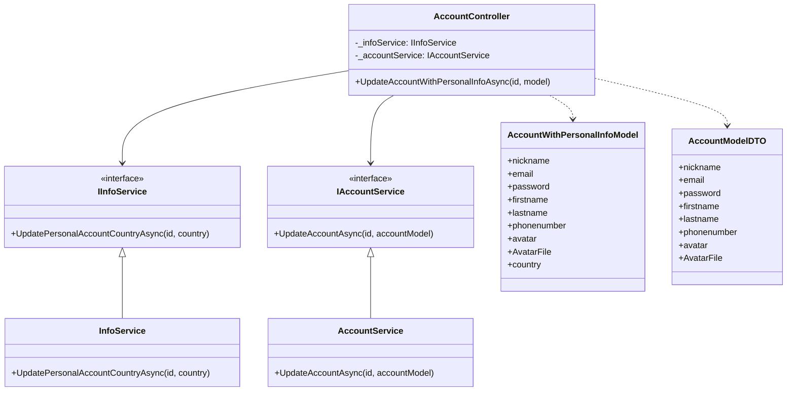
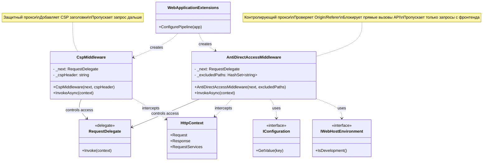
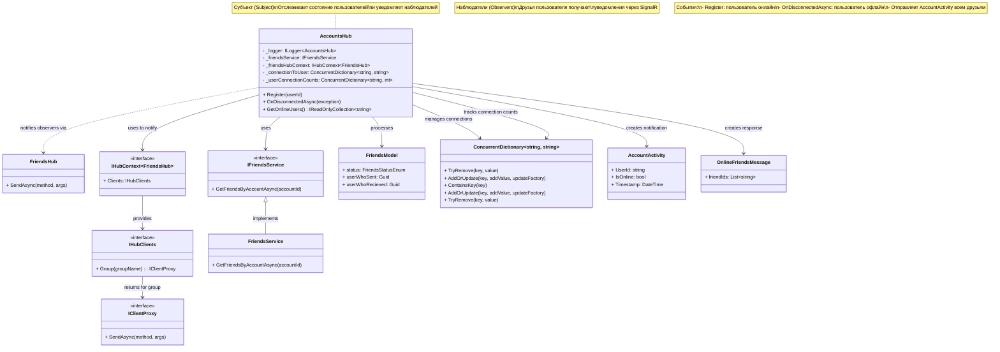
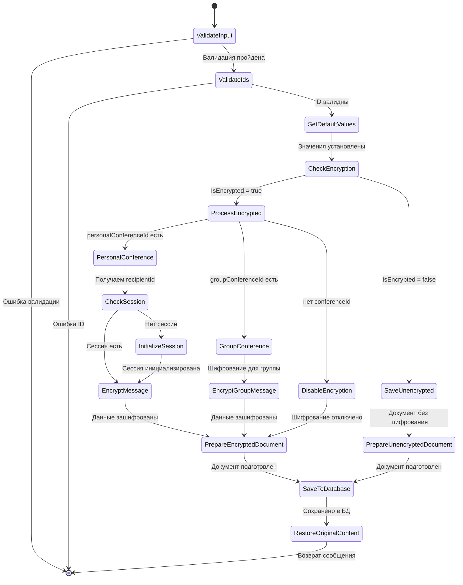
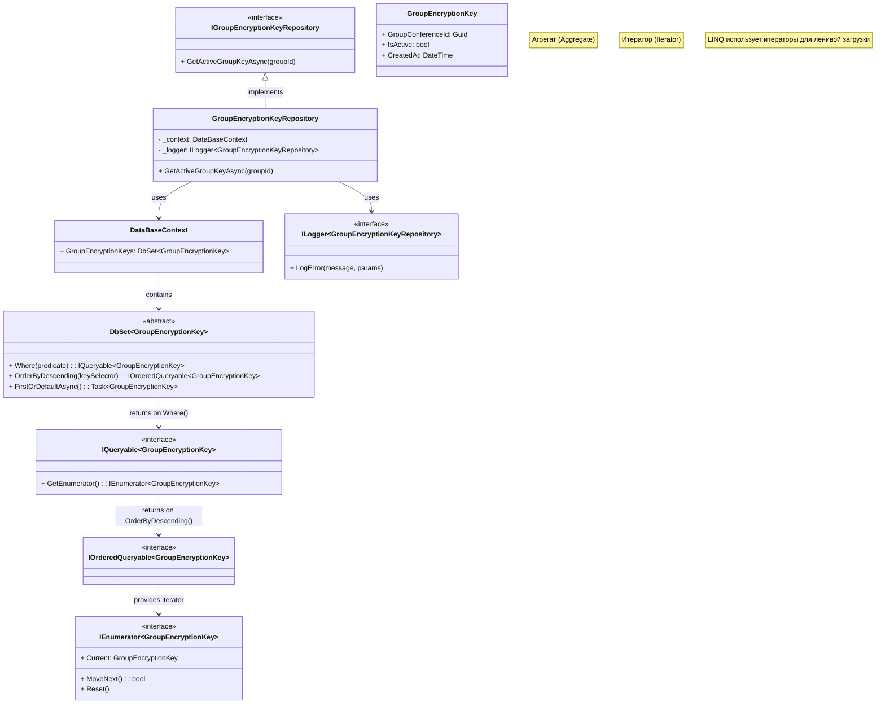
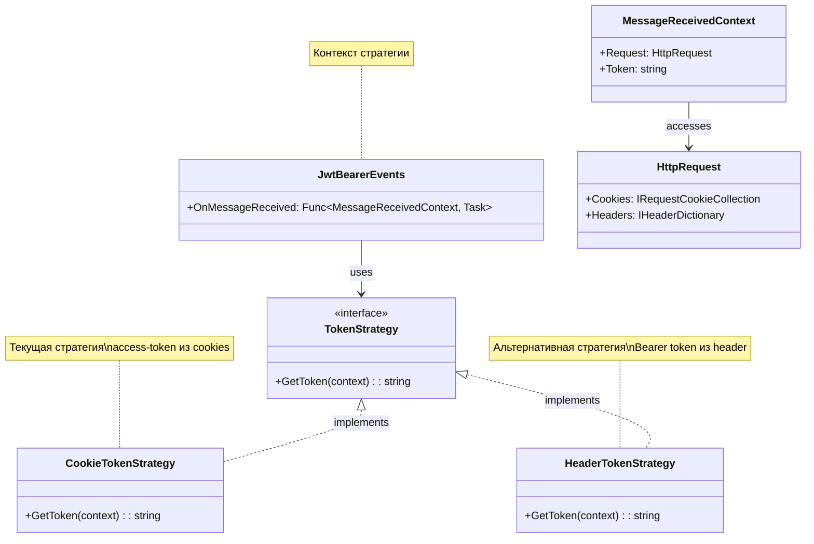
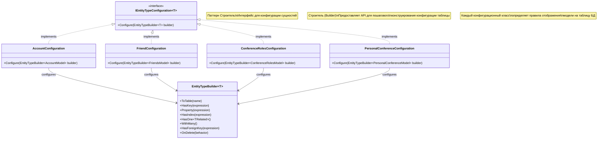
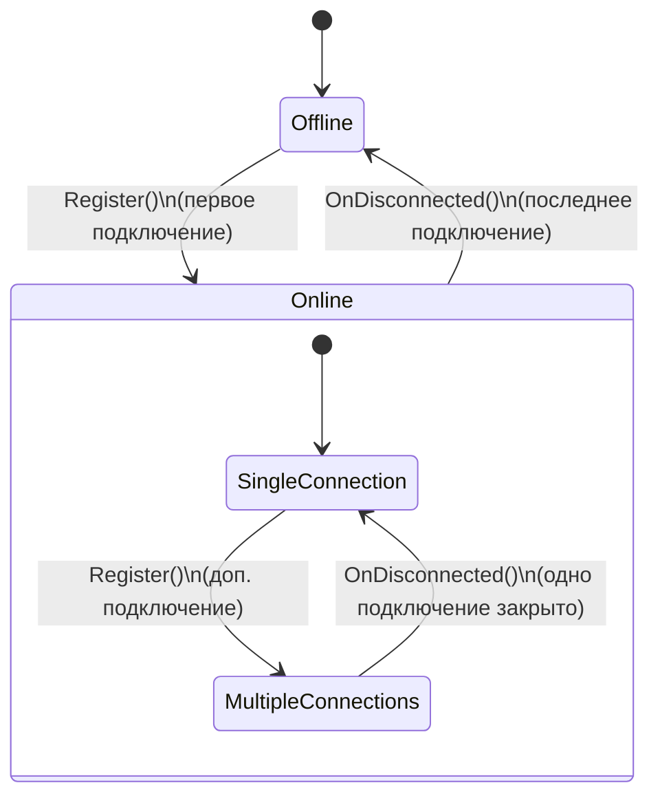

# Структурные шаблоны

## Facade

Предоставляет унифицированный интерфейс вместо набора интерфейсов некоторой подсистемы. Фасад определяет интерфейс более высокого уровня, который упрощает использование подсистемы.

Шаблон Фасад объединяет группу объектов в рамках одного специализированного интерфейса и переадресует вызовы его методов к этим объектам.

Когда использовать фасад?
1) Когда имеется сложная система, и необходимо упростить с ней работу. Фасад позволит определить одну точку взаимодействия между клиентом и системой.
2) Когда надо уменьшить количество зависимостей между клиентом и сложной системой. Фасадные объекты позволяют отделить, изолировать компоненты системы от клиента и развивать и работать с ними независимо.
3) Когда нужно определить подсистемы компонентов в сложной системе. Создание фасадов для компонентов каждой отдельной подсистемы позволит упростить взаимодействие между ними и повысить их независимость друг от друга.

В нашем случае фасад применяется для того, чтобы скрыть от клиента (фронтенда) детали взаимодействия между сервисами, дабы понизить сложность взаимодействия с вызываемыми методами. Пример:

```csharp
public class AccountController : ControllerBase
{
    private readonly IAccountService _accountService;
    private readonly IPersonalAccountInfoService _infoService;
    private readonly IEmailService _emailService;
    // Тут еще куча методов

    // Один метод скрывает сложность работы с разными сервисами
    [ValidateAntiForgeryToken]
        [HttpPut("full_account_info/{id}")]
        public async Task<IActionResult> UpdateAccountWithPersonalInfoAsync(Guid id, [FromForm] AccountWithPersonalInfoModel model)
        {
            var cookie = Request.Headers["Cookie"].ToString();
            var token = Request.Headers["X-CSRF-TOKEN"].ToString();
            try
            {
                var countryUpdateResult = await _infoService.UpdatePersonalAccountCountryAsync(id, model.country); // тут обновили страну
                var updatedAccount = new AccountModelDTO // тут просто собрали данные
                {
                    nickname = model.nickname,
                    email = model.email,
                    password = model.password,
                    firstname = model.firstname,
                    lastname = model.lastname,
                    phonenumber = model.phonenumber,
                    avatar = model.avatar,
                    AvatarFile = model.AvatarFile
                };
                var accountUpdateResult = await _accountService.UpdateAccountAsync(id, updatedAccount); // тут обновили аккаунт

                return Ok("Account and personal info updated!");
            }
            catch (Exception ex)
            {
                return StatusCode(500, $"Internal server error: {ex.Message}");
            }
        }
}
```


## Proxy

Прокси-объект контролирует доступ к другому объекту. Middleware в ASP.NET Core — это классическая реализация паттерна "Заместитель":

«Заместитель» является одним из немногих паттернов проектирования, который с течением времени претерпел довольно серьезные изменения. В классическом труде «банды четырех» описаны три основных сценария использования паттерна «Заместитель».
1) Удаленный заместитель (remote proxies) — ​отвечает за кодирование запроса и его аргументов для работы с компонентом в другом адресном пространстве.
2) Виртуальный заместитель (virtual proxies) —​ может кэшировать дополнительную информацию о реальном компоненте, чтобы отложить его создание.
3) Защищающий заместитель (protection proxies) — проверяет, имеет ли вызывающий объект необходимые для выполнения запроса права.​

В нашем случае в конвейер middleware встроены 2 кастомных middleware, которые не позволяют конвейеру полностью выполниться, если не выполнены условия в них содержащиеся - отсутствуют нужные токены(чтобы нельзя было у пользователя украсть access токен и отправлять от его имени запросы + проверка на выполнение JS кода на странице)

Конкретные строчки встраивания в конвейер:

```csharp
// WebApplicationExtensions.cs
app.UseMiddleware<CspMiddleware>(cspPolicy);
app.UseMiddleware<AntiDirectAccessMiddleware>(excludedPaths);
```
Сами middleware:

```csharp
public class AntiDirectAccessMiddleware
{
    private readonly RequestDelegate _next;
    private readonly HashSet<string> _excludedPaths;

    public AntiDirectAccessMiddleware(RequestDelegate next, HashSet<string> excludedPaths)
    {
        _next = next;
        _excludedPaths = excludedPaths;
    }

    public async Task InvokeAsync(HttpContext context)
    {
        var path = context.Request.Path.Value?.ToLowerInvariant() ?? "";

        if (_excludedPaths.Any(excluded => path.StartsWith(excluded.ToLowerInvariant())))
        {
            await _next(context);
            return;
        }

        var configuration = context.RequestServices.GetRequiredService<IConfiguration>();
        var env = context.RequestServices.GetRequiredService<IWebHostEnvironment>();

        // В режиме разработки пропускаем все запросы
        if (env.IsDevelopment())
        {
            await _next(context);
            return;
        }

        // PRODUCTION: Проверка Origin или Referer
        var origin = context.Request.Headers["Origin"].ToString();
        var referer = context.Request.Headers["Referer"].ToString();
        var allowedUrl = configuration["Frontend_Url:Url"] ?? "https://syncro-test.ru";

        // Если нет ни Origin, ни Referer - блокируем (Postman, curl)
        if (string.IsNullOrEmpty(origin) && string.IsNullOrEmpty(referer))
        {
            context.Response.StatusCode = StatusCodes.Status403Forbidden;
            await context.Response.WriteAsync("Access denied: Direct API access is not allowed.");
            return;
        }

        bool isValid = false;

        // Проверяем Origin, если он есть
        if (!string.IsNullOrEmpty(origin))
        {
            isValid = origin.StartsWith(allowedUrl, StringComparison.OrdinalIgnoreCase);
        }
        // Если Origin нет, но есть Referer - проверяем Referer
        else if (!string.IsNullOrEmpty(referer))
        {
            isValid = referer.StartsWith(allowedUrl, StringComparison.OrdinalIgnoreCase);
        }

        if (!isValid)
        {
            context.Response.StatusCode = StatusCodes.Status403Forbidden;
            await context.Response.WriteAsync("Access denied: Invalid origin or referer.");
            return;
        }

        // Проверяем наличие Sec-Fetch заголовков (современные браузеры)
        var secFetchMode = context.Request.Headers["Sec-Fetch-Mode"].FirstOrDefault();
        var secFetchDest = context.Request.Headers["Sec-Fetch-Dest"].FirstOrDefault();
        var secFetchSite = context.Request.Headers["Sec-Fetch-Site"].FirstOrDefault();

        if (!string.IsNullOrEmpty(secFetchMode) || !string.IsNullOrEmpty(secFetchDest))
        {
            // Если это навигация или встраиваемый ресурс — запрещаем
            if (secFetchMode == "navigate" ||
                secFetchDest == "document" ||
                secFetchDest == "object" ||
                secFetchDest == "embed")
            {
                context.Response.StatusCode = StatusCodes.Status403Forbidden;
                await context.Response.WriteAsync("Direct navigation to API is not allowed.");
                return;
            }

            await _next(context);
            return;
        }

        await _next(context);
    }
}
```
```csharp
public class CspMiddleware
{
    private readonly RequestDelegate _next;
    private readonly string _cspHeader;

    public CspMiddleware(RequestDelegate next, string cspHeader)
    {
        _next = next;
        _cspHeader = cspHeader;
    }

    public async Task InvokeAsync(HttpContext context)
    {
        context.Response.Headers.Append("Content-Security-Policy", _cspHeader);
        await _next(context);
    }
}
```



## Decorator

Динамически добавляет объекту новые обязанности. Является гибкой альтернативой порождению подклассов с целью расширения функциональности.

Когда следует использовать декораторы?

Когда надо динамически добавлять к объекту новые функциональные возможности. При этом данные возможности могут быть сняты с объекта

Когда применение наследования неприемлемо. Например, если нам надо определить множество различных функциональностей и для каждой функциональности наследовать отдельный класс, то структура классов может очень сильно разрастись. Еще больше она может разрастись, если нам необходимо создать классы, реализующие все возможные сочетания добавляемых функциональностей.

Pipeline middleware в ASP.NET Core построен на паттерне "Декоратор". Каждый middleware "оборачивает" следующий, добавляя новое поведение:

Сами middleware и их устройство:

```csharp
public static void ConfigurePipeline(this WebApplication app)
        {
            if (app.Environment.IsDevelopment())
            {
                app.UseSwagger();
                app.UseSwaggerUI();
            }
            else
            {
                // Production: nginx handles HTTPS (SSL termination)
                // ForwardedHeaders middleware reads X-Forwarded-Proto and other headers from nginx
                app.UseForwardedHeaders(new ForwardedHeadersOptions
                {
                    ForwardedHeaders = Microsoft.AspNetCore.HttpOverrides.ForwardedHeaders.XForwardedFor |
                                       Microsoft.AspNetCore.HttpOverrides.ForwardedHeaders.XForwardedProto
                });
            }

            app.UseCors("FrontendPolicy");
            app.UseCookiePolicy(new CookiePolicyOptions
            {
                MinimumSameSitePolicy = SameSiteMode.Lax,
                Secure = CookieSecurePolicy.SameAsRequest,
            });

            app.UseRouting();
            app.UseAntiforgery();

            app.UseAuthentication();
            app.UseAuthorization();
            var excludedPaths = new HashSet<string>(StringComparer.OrdinalIgnoreCase)
            {
                "/friendshub",
                "/groupshub",
                "/accountshub",
                "/personalmessageshub",
                "/videochathub",
                "/swagger"
            };
            string cspPolicy = "default - src 'self'; script - src 'self'; style - src 'self'; img - src 'self' data: https:; font - src 'self'; connect - src 'self'; frame - ancestors 'none'; base - uri 'self'; form - action 'self'";
            app.UseMiddleware<CspMiddleware>(cspPolicy);
            app.UseMiddleware<AntiDirectAccessMiddleware>(excludedPaths);

        }
```

Устройство единицы конвейера:

```csharp
public class TokenMiddleware
{
    private readonly RequestDelegate next;
 
    public TokenMiddleware(RequestDelegate next)
    {
        this.next = next; // двигаем дальше если все хорошо
    }
 
    public async Task InvokeAsync(HttpContext context)
    {
        var token = context.Request.Query["token"];
        if (token!="12345678")
        {
            context.Response.StatusCode = 403;
            await context.Response.WriteAsync("Token is invalid");
        }
        else
        {
            await next.Invoke(context); // если все хорошо, выполняем invoke контекста и двигаем дальше по конвейеру
        }
    }
}
```



```mermaid
classDiagram
    class WebApplication {
        +UseMiddleware()
        +UseCors()
        +UseCookiePolicy()
        +UseRouting()
        +UseAntiforgery()
        +UseAuthentication()
        +UseAuthorization()
        +UseSwagger()
        +UseSwaggerUI()
        +UseForwardedHeaders()
    }

    class IApplicationBuilder {
        <<interface>>
        +Use()
        +Build()
    }

    class RequestDelegate {
        <<delegate>>
        +Invoke(HttpContext)
    }

    class CorsMiddleware {
        +InvokeAsync(HttpContext)
    }

    class CookiePolicyMiddleware {
        +InvokeAsync(HttpContext)
    }

    class RoutingMiddleware {
        +InvokeAsync(HttpContext)
    }

    class AntiforgeryMiddleware {
        +InvokeAsync(HttpContext)
    }

    class AuthenticationMiddleware {
        +InvokeAsync(HttpContext)
    }

    class AuthorizationMiddleware {
        +InvokeAsync(HttpContext)
    }

    class CspMiddleware {
        +InvokeAsync(HttpContext)
    }

    class AntiDirectAccessMiddleware {
        +InvokeAsync(HttpContext)
    }

    class SwaggerMiddleware {
        +InvokeAsync(HttpContext)
    }

    class SwaggerUIMiddleware {
        +InvokeAsync(HttpContext)
    }

    class ForwardedHeadersMiddleware {
        +InvokeAsync(HttpContext)
    }

    WebApplication --|> IApplicationBuilder : implements
    
    IApplicationBuilder o-- RequestDelegate : builds chain
    
    RequestDelegate <|-- CorsMiddleware : decorates
    RequestDelegate <|-- CookiePolicyMiddleware : decorates
    RequestDelegate <|-- RoutingMiddleware : decorates
    RequestDelegate <|-- AntiforgeryMiddleware : decorates
    RequestDelegate <|-- AuthenticationMiddleware : decorates
    RequestDelegate <|-- AuthorizationMiddleware : decorates
    RequestDelegate <|-- CspMiddleware : decorates
    RequestDelegate <|-- AntiDirectAccessMiddleware : decorates
    RequestDelegate <|-- SwaggerMiddleware : decorates
    RequestDelegate <|-- SwaggerUIMiddleware : decorates
    RequestDelegate <|-- ForwardedHeadersMiddleware : decorates
    
    note for RequestDelegate "Базовый компонент обработки запроса"
    
    note "Каждый middleware добавляет новое поведение к конвейеру обработки запроса, оборачивая существующий RequestDelegate"
    
    WebApplication --> CorsMiddleware : adds to chain
    WebApplication --> CookiePolicyMiddleware : adds to chain
    WebApplication --> RoutingMiddleware : adds to chain
    WebApplication --> AntiforgeryMiddleware : adds to chain
    WebApplication --> AuthenticationMiddleware : adds to chain
    WebApplication --> AuthorizationMiddleware : adds to chain
    WebApplication --> CspMiddleware : adds to chain
    WebApplication --> AntiDirectAccessMiddleware : adds to chain
    WebApplication --> SwaggerMiddleware : adds (dev)
    WebApplication --> SwaggerUIMiddleware : adds (dev)
    WebApplication --> ForwardedHeadersMiddleware : adds (prod)
```

# Поведенческие шаблоны

## Observer

Паттерн "Наблюдатель" определяет зависимость "один ко многим", где при изменении состояния одного объекта все зависимые оповещаются. SignalR — это реализация этого паттерна.

```csharp
using System.Collections.Concurrent;
using System.Linq;
using libsignalservice.push.exceptions;
using Microsoft.AspNetCore.Authorization;
using Microsoft.AspNetCore.SignalR;


namespace Syncro.Api.Hubs
{
    public class AccountsHub : Hub
    {
        private readonly ILogger<AccountsHub> _logger;
        private readonly IFriendsService _friendsService;
        private readonly IHubContext<FriendsHub> _friendsHubContext;

        private static readonly ConcurrentDictionary<string, string> _connectionToUser = new();
        private static readonly ConcurrentDictionary<string, int> _userConnectionCounts = new();

        public AccountsHub(ILogger<AccountsHub> logger, IFriendsService friendsService, IHubContext<FriendsHub> friendsHubContext)
        {
            _logger = logger;
            _friendsService = friendsService;
            _friendsHubContext = friendsHubContext;
        }

        public async Task Register(string userId)
        {
            if (string.IsNullOrWhiteSpace(userId))
            {
                _logger.LogWarning("Register called with empty userId for connection {ConnectionId}", Context.ConnectionId);
                return;
            }

            _connectionToUser[Context.ConnectionId] = userId;

            var newCount = _userConnectionCounts.AddOrUpdate(userId, 1, (_, old) => old + 1);

            if (newCount == 1)
            {
                _logger.LogInformation("User {UserId} went online", userId);

                if (Guid.TryParse(userId, out var userGuid))
                {
                    try
                    {
                        var friends = await _friendsService.GetFriendsByAccountAsync(userGuid);
                        var friendIds = friends
                            .Where(f => f.status == FriendsStatusEnum.Accepted)
                            .Select(f => f.userWhoSent == userGuid ? f.userWhoRecieved : f.userWhoSent)
                            .Distinct();

                        var notificationTasks = friendIds.Select(async friendId =>
                        {
                            try
                            {
                                await _friendsHubContext.Clients.Group($"friends-{friendId}").SendAsync("AccountActivity", new
                                {
                                    UserId = userId,
                                    IsOnline = true,
                                    Timestamp = DateTime.UtcNow
                                });
                            }
                            catch (Exception ex)
                            {
                                _logger.LogWarning(ex, "Failed to notify friend {FriendId} about user {UserId} activity", friendId, userId);
                            }
                        });

                        await Task.WhenAll(notificationTasks);
                    }
                    catch (NotFoundException) // Специфическое исключение
                    {
                        _logger.LogDebug("User {UserId} has no friends, skipping online notifications", userId);
                        // Это нормальная ситуация, не логируем как ошибку
                    }
                    catch (Exception ex)
                    {
                        _logger.LogError(ex, "Failed to get friends for user {UserId} during online notification", userId);
                    }
                }
            }

            if (Guid.TryParse(userId, out var callerGuid))
            {
                try
                {
                    List<FriendsModel> friends;
                    try
                    {
                        friends = await _friendsService.GetFriendsByAccountAsync(callerGuid);
                    }
                    catch (NotFoundException)
                    {
                        _logger.LogDebug("User {UserId} has no friends, sending empty list", userId);
                        await Clients.Caller.SendAsync("OnlineFriends", new List<string>());
                        return;
                    }

                    if (friends is { Count: > 0 })
                    {
                        var friendIds = friends
                            .Where(f => f.status == FriendsStatusEnum.Accepted)
                            .Select(f => f.userWhoSent == callerGuid ? f.userWhoRecieved : f.userWhoSent)
                            .Distinct()
                            .Select(g => g.ToString())
                            .Where(s => _userConnectionCounts.ContainsKey(s))
                            .ToList();

                        await Clients.Caller.SendAsync("OnlineFriends", friendIds);
                    }
                    else
                    {
                        await Clients.Caller.SendAsync("OnlineFriends", new List<string>());
                    }
                }
                catch (Exception ex)
                {
                    _logger.LogError(ex, "Failed to get or process friends for user {UserId}", userId);
                    await Clients.Caller.SendAsync("OnlineFriends", new List<string>());
                }
            }
            else
            {
                await Clients.Caller.SendAsync("OnlineFriends", new List<string>());
            }
        }

        public override async Task OnDisconnectedAsync(Exception? exception)
        {
            try
            {
                if (_connectionToUser.TryRemove(Context.ConnectionId, out var userId))
                {
                    var newCount = _userConnectionCounts.AddOrUpdate(userId, 0, (_, old) => Math.Max(old - 1, 0));

                    if (newCount == 0)
                    {
                        _userConnectionCounts.TryRemove(userId, out _);
                        _logger.LogInformation("User {UserId} went offline", userId);

                        if (Guid.TryParse(userId, out var userGuid))
                        {
                            try
                            {
                                List<FriendsModel> friends;
                                try
                                {
                                    friends = await _friendsService.GetFriendsByAccountAsync(userGuid);
                                }
                                catch (NotFoundException)
                                {
                                    _logger.LogDebug("User {UserId} has no friends, skipping offline notifications", userId);
                                    return;
                                }

                                var friendIds = friends
                                    .Where(f => f.status == Syncro.Domain.Enums.FriendsStatusEnum.Accepted)
                                    .Select(f => f.userWhoSent == userGuid ? f.userWhoRecieved : f.userWhoSent)
                                    .Distinct();

                                foreach (var friendId in friendIds)
                                {
                                    await _friendsHubContext.Clients.Group($"friends-{friendId}").SendAsync("AccountActivity", new
                                    {
                                        UserId = userId,
                                        IsOnline = false,
                                        Timestamp = DateTime.UtcNow
                                    });
                                }
                            }
                            catch (Exception ex)
                            {
                                _logger.LogError(ex, "Failed to notify friends about offline for user {UserId}", userId);
                            }
                        }
                    }
                }
            }
            catch (Exception ex)
            {
                _logger.LogError(ex, "Error handling disconnection for {ConnectionId}", Context.ConnectionId);
            }

            _logger.LogInformation("Client disconnected: {ConnectionId}", Context.ConnectionId);
            await base.OnDisconnectedAsync(exception);
        }

        public static IReadOnlyCollection<string> GetOnlineUsers()
        {
            return _userConnectionCounts.Where(kv => kv.Value > 0).Select(kv => kv.Key).ToList().AsReadOnly();
        }
    }
}
```



## Chain of Responsibility

В данном случае примером цепочки обязанностей мог снова стать middleware, либо же атрибуты, навешенные на эндпоинты, однако приведем более неявный пример, который можно выделить в отдельный мини-конвейер с цепочкой обязанностей. Здесь обработка происходит поэтапно и может быть сброшена при соблюдении определенных условий, в связи с чем целевое действие выполнено не будет:

```csharp
public async Task<MessageModel> CreateMessageAsync(MessageModel message)
        {
            try
            {
                if (message.messageContent == null)
                {
                    throw new ArgumentException("Message content is empty");
                }

                if (message.accountId == null)
                {
                    throw new ArgumentException("AccountId cannot be null");
                }

                if (message.Id == Guid.Empty)
                {
                    message.Id = Guid.NewGuid();
                }

                if (message.messageDateSent == default)
                {
                    message.messageDateSent = DateTime.UtcNow;
                }

                if (message.IsEncrypted)
                {
                    byte[] encryptedContent;
                    string metadataJson;

                    if (message.personalConferenceId.HasValue)
                    {
                        var recipientId = await GetRecipientIdAsync(message.personalConferenceId.Value, message.accountId.Value);

                        var hasSession = await _encryptionService.HasSessionAsync(message.accountId.Value, recipientId);
                        if (!hasSession)
                        {
                            try
                            {
                                var recipientPublicKey = await _encryptionService.GetPublicKeyAsync(recipientId);
                                await _encryptionService.InitializeSessionAsync(message.accountId.Value, recipientId, recipientPublicKey);
                            }
                            catch (Exception ex)
                            {
                                Console.WriteLine($"Warning: Failed to auto-initialize session: {ex.Message}");
                                throw new InvalidOperationException("Encryption session not initialized. Call /api/encryption/sessions/initialize first.");
                            }
                        }

                        var encryptionResult = await _encryptionService.EncryptMessageAsync(
                            message.messageContent,
                            message.accountId.Value,
                            recipientId
                        );

                        encryptedContent = encryptionResult.EncryptedData;
                        metadataJson = JsonSerializer.Serialize(encryptionResult.Metadata);
                    }
                    else if (message.groupConferenceId.HasValue)
                    {
                        var encryptionResult = await _encryptionService.EncryptMessageAsync(
                            message.messageContent,
                            message.accountId.Value,
                            Guid.Empty,
                            message.groupConferenceId.Value
                        );

                        encryptedContent = encryptionResult.EncryptedData;
                        metadataJson = JsonSerializer.Serialize(encryptionResult.Metadata);
                    }
                    else
                    {
                        message.IsEncrypted = false;
                        encryptedContent = System.Text.Encoding.UTF8.GetBytes(message.messageContent);
                        metadataJson = null;
                    }

                    var originalContent = message.messageContent;

                    message.EncryptedContent = encryptedContent;
                    message.EncryptionMetadata = metadataJson;
                    message.messageContent = Convert.ToBase64String(encryptedContent);

                    var document = new JObject
                    {
                        ["type"] = "message",
                        ["id"] = message.Id,
                        ["messageContent"] = message.messageContent,
                        ["messageDateSent"] = message.messageDateSent,
                        ["accountId"] = message.accountId,
                        ["accountNickname"] = message.accountNickname,
                        ["personalConferenceId"] = message.personalConferenceId,
                        ["groupConferenceId"] = message.groupConferenceId,
                        ["sectorId"] = message.sectorId,
                        ["isEdited"] = message.isEdited,
                        ["previousMessageContent"] = message.previousMessageContent,
                        ["isPinned"] = message.isPinned,
                        ["isRead"] = message.isRead,
                        ["referenceMessageId"] = message.referenceMessageId,
                        ["MediaUrl"] = message.MediaUrl,
                        ["MediaType"] = message.MediaType?.ToString(),
                        ["FileName"] = message.FileName,

                        ["IsEncrypted"] = message.IsEncrypted,
                        ["EncryptionMetadata"] = message.EncryptionMetadata,
                        ["EncryptionVersion"] = message.EncryptionVersion
                    };

                    await _collection.InsertAsync(GetMessageKey(message.Id), document);

                    message.messageContent = originalContent;
                    message.EncryptedContent = null;
                }
                else
                {
                    var document = new JObject
                    {
                        ["type"] = "message",
                        ["id"] = message.Id,
                        ["messageContent"] = message.messageContent,
                        ["messageDateSent"] = message.messageDateSent,
                        ["accountId"] = message.accountId,
                        ["accountNickname"] = message.accountNickname,
                        ["personalConferenceId"] = message.personalConferenceId,
                        ["groupConferenceId"] = message.groupConferenceId,
                        ["sectorId"] = message.sectorId,
                        ["isEdited"] = message.isEdited,
                        ["previousMessageContent"] = message.previousMessageContent,
                        ["isPinned"] = message.isPinned,
                        ["isRead"] = message.isRead,
                        ["referenceMessageId"] = message.referenceMessageId,
                        ["MediaUrl"] = message.MediaUrl,
                        ["MediaType"] = message.MediaType?.ToString(),
                        ["FileName"] = message.FileName,
                        ["IsEncrypted"] = message.IsEncrypted,
                        ["EncryptionVersion"] = message.EncryptionVersion
                    };

                    await _collection.InsertAsync(GetMessageKey(message.Id), document);
                }

                return message;
            }
            catch (Exception ex)
            {
                Console.WriteLine($"Error creating message: {ex}");
                throw;
            }
        }
```



## Iterator

LINQ и EF Core используют паттерн "Итератор" для последовательного доступа к элементам коллекции без раскрытия внутреннего представления

Допустим в GroupEncryptionKeyRepository как раз используется LINQ:

```csharp
public async Task<GroupEncryptionKey?> GetActiveGroupKeyAsync(Guid groupId)
        {
            try
            {
                return await _context.GroupEncryptionKeys
                    .Where(k => k.GroupConferenceId == groupId && k.IsActive)
                    .OrderByDescending(k => k.CreatedAt)
                    .FirstOrDefaultAsync();
            }
            catch (Exception ex)
            {
                _logger.LogError(ex, "Error getting active group key for group {GroupId}", groupId);
                throw;
            }
        }
```



## Strategy

Паттерн "Стратегия" позволяет выбирать алгоритм поведения во время выполнения. 

В коде это явно видно на примере JWT, а конкретно на моменте сбора access-token в ApiExtensions, мы можем с легкостью замени передачу через куки на передачу через header authorization

```csharp
.AddJwtBearer(JwtBearerDefaults.AuthenticationScheme, options =>
            {
                options.TokenValidationParameters = new()
                {
                    ValidateIssuer = false,
                    ValidateAudience = false,
                    ValidateLifetime = true,
                    ValidateIssuerSigningKey = true,
                    IssuerSigningKey = new SymmetricSecurityKey(
                        Encoding.UTF8.GetBytes(secret))
                };
                options.Events = new JwtBearerEvents
                {
                    OnMessageReceived = context =>
                    {
                        context.Token = context.Request.Cookies["access-token"];
                        return Task.CompletedTask;
                    }
                };
            });
```



## Template Method

Шаблонный метод определяет скелет алгоритма, перекладывая некоторые шаги на подклассы.

```csharp
namespace Syncro.Infrastructure.Data.Configurations
{
    public class AccountConfiguration : IEntityTypeConfiguration<AccountModel>
    {
        public void Configure(EntityTypeBuilder<AccountModel> builder)
        {
            builder.ToTable("Accounts");
            builder.HasKey(x => x.Id);

            builder.Property(x => x.Id).ValueGeneratedOnAdd().HasColumnType("uuid").HasDefaultValueSql("gen_random_uuid()");
            builder.Property(x => x.nickname).IsRequired().HasMaxLength(100);
            builder.Property(x => x.email).HasMaxLength(250).IsRequired(false);
            builder.Property(x => x.password).IsRequired().HasMaxLength(200).HasConversion(p => BCrypt.Net.BCrypt.EnhancedHashPassword(p), p => p);
            builder.Property(x => x.firstname).IsRequired(false);
            builder.Property(x => x.lastname).IsRequired(false);
            builder.Property(x => x.phonenumber).HasMaxLength(20).IsRequired(false);
            builder.Property(x => x.avatar).IsRequired(false);
        }
    }
}
```

В данной работе внедрение EF может служить таким паттерном. Используется IEntityTypeConfiguration, которая определяет, что ей обязательно должна быть передана сущность(какая либо) и обязательно должен быть создан метод Configure, после этого все остальные настройки передаются наследникам, как в данном случае AccountConfiguration



## State

В AccountsHub.cs отслеживается состояние пользователей (онлайн/офлайн), и поведение системы меняется в зависимости от этого состояния

```csharp
public static IReadOnlyCollection<string> GetOnlineUsers()
        {
            return _userConnectionCounts.Where(kv => kv.Value > 0).Select(kv => kv.Key).ToList().AsReadOnly();
        }
```
```csharp
public override async Task OnDisconnectedAsync(Exception? exception)
        {
            try
            {
                if (_connectionToUser.TryRemove(Context.ConnectionId, out var userId))
                {
                    var newCount = _userConnectionCounts.AddOrUpdate(userId, 0, (_, old) => Math.Max(old - 1, 0));

                    if (newCount == 0)
                    {
                        _userConnectionCounts.TryRemove(userId, out _);
                        _logger.LogInformation("User {UserId} went offline", userId);

                        if (Guid.TryParse(userId, out var userGuid))
                        {
                            try
                            {
                                List<FriendsModel> friends;
                                try
                                {
                                    friends = await _friendsService.GetFriendsByAccountAsync(userGuid);
                                }
                                catch (NotFoundException)
                                {
                                    _logger.LogDebug("User {UserId} has no friends, skipping offline notifications", userId);
                                    return;
                                }

                                var friendIds = friends
                                    .Where(f => f.status == Syncro.Domain.Enums.FriendsStatusEnum.Accepted)
                                    .Select(f => f.userWhoSent == userGuid ? f.userWhoRecieved : f.userWhoSent)
                                    .Distinct();

                                foreach (var friendId in friendIds)
                                {
                                    await _friendsHubContext.Clients.Group($"friends-{friendId}").SendAsync("AccountActivity", new
                                    {
                                        UserId = userId,
                                        IsOnline = false,
                                        Timestamp = DateTime.UtcNow
                                    });
                                }
                            }
                            catch (Exception ex)
                            {
                                _logger.LogError(ex, "Failed to notify friends about offline for user {UserId}", userId);
                            }
                        }
                    }
                }
            }
            catch (Exception ex)
            {
                _logger.LogError(ex, "Error handling disconnection for {ConnectionId}", Context.ConnectionId);
            }

            _logger.LogInformation("Client disconnected: {ConnectionId}", Context.ConnectionId);
            await base.OnDisconnectedAsync(exception);
        }
```
```csharp
public async Task Register(string userId)
        {
            if (string.IsNullOrWhiteSpace(userId))
            {
                _logger.LogWarning("Register called with empty userId for connection {ConnectionId}", Context.ConnectionId);
                return;
            }

            _connectionToUser[Context.ConnectionId] = userId;

            var newCount = _userConnectionCounts.AddOrUpdate(userId, 1, (_, old) => old + 1);

            if (newCount == 1)
            {
                _logger.LogInformation("User {UserId} went online", userId);

                if (Guid.TryParse(userId, out var userGuid))
                {
                    try
                    {
                        var friends = await _friendsService.GetFriendsByAccountAsync(userGuid);
                        var friendIds = friends
                            .Where(f => f.status == FriendsStatusEnum.Accepted)
                            .Select(f => f.userWhoSent == userGuid ? f.userWhoRecieved : f.userWhoSent)
                            .Distinct();

                        var notificationTasks = friendIds.Select(async friendId =>
                        {
                            try
                            {
                                await _friendsHubContext.Clients.Group($"friends-{friendId}").SendAsync("AccountActivity", new
                                {
                                    UserId = userId,
                                    IsOnline = true,
                                    Timestamp = DateTime.UtcNow
                                });
                            }
                            catch (Exception ex)
                            {
                                _logger.LogWarning(ex, "Failed to notify friend {FriendId} about user {UserId} activity", friendId, userId);
                            }
                        });

                        await Task.WhenAll(notificationTasks);
                    }
                    catch (NotFoundException) // Специфическое исключение
                    {
                        _logger.LogDebug("User {UserId} has no friends, skipping online notifications", userId);
                        // Это нормальная ситуация, не логируем как ошибку
                    }
                    catch (Exception ex)
                    {
                        _logger.LogError(ex, "Failed to get friends for user {UserId} during online notification", userId);
                    }
                }
            }
```



# Шаблоны проектирования GRASP

## Information Expert

Проблема:
Как распределить ответственность между классами, чтобы код был интуитивно понятным и поддерживаемым?

Решение:
Ответственность должна быть назначена тому классу, который владеет максимумом необходимой информации для её исполнения.

```csharp
// AccountService.cs
public class AccountService : IAccountService
{
    private readonly IAccountRepository _accountRepository;
    private readonly IJwtProvider _jwtProvider;
    private readonly ISelectelStorageService _selectelStorageService;

    public async Task<AccountModel> GetAccountByIdAsync(Guid accountId)
    {
        // Репозиторий знает, откуда брать данные (БД).
        return await _accountRepository.GetAccountByIdAsync(accountId);
    }

    public async Task<string> GetAccountAvatarUrlAsync(Guid accountId)
    {
        // Информационный эксперт для URL аватара - сервис хранилища
        var account = await _accountRepository.GetAccountByIdAsync(accountId);
        var key = account.avatar.Replace($"{_cdnUrl}/", "");
        return await _selectelStorageService.GetTemporaryFileUrlAsync(key);
    }
}
```
Результаты:
* Логика получения аккаунта находится в репозитории, который имеет прямой доступ к данным
* Логика работы с аватарами делегирована сервису хранилища, который знает как работать с S3
* Высокая связность (High Cohesion) и низкое зацепление (Low Coupling)

Связь с другими паттернами:
* Поддерживает High Cohesion
* Работает вместе с Pure Fabrication
* Реализует Polymorphism через интерфейсы


## Creator

Проблема:
Кто должен отвечать за создание новых экземпляров объектов?

Решение:
Класс должен создавать экземпляры других классов, если он содержит, агрегирует, использует, инициализирует или записывает создаваемые объекты.

```csharp
// AccountController.cs
[HttpPost]
public async Task<ActionResult<AccountNoPasswordModel>> CreateAccount([FromBody] AccountModel account)
{
    try
    {
        // Контроллер создает запрос на создание аккаунта,
        // делегируя фактическое создание сервису
        var createdAccount = await _accountService.CreateAccountAsync(account);
        
        // Контроллер создает модель для ответа (Transfer Model)
        var createdAccountNoPassword = TranferModelsMapper.AccountNoPasswordModelMapMapper(createdAccount);
        
        // Сервис создает персональную информацию
        var createdPersonalAccountInfo = await _infoService.CreatePersonalAccountInfoAsync(account.Id);
        
        return CreatedAtAction(nameof(GetAccountById), new { id = createdAccount.Id }, createdAccountNoPassword);
    }
    catch (Exception ex)
    {
        // Обработка ошибок
        return StatusCode(500, new { success = false, error = "Internal server error" });
    }
}

public async Task<FriendsModel> CreateFriendsAsync(FriendsModel friends)
{
    // Валидация
    if (friends.userWhoSent == friends.userWhoRecieved)
    {
        throw new ArgumentException("You can't be friend with yourself");
    }
    
    // Создание через репозиторий (создатель)
    var createdFriend = await _friendsRepository.AddAsync(friends);
    
    // Уведомление через хаб
    await _hubContext.Clients.Group($"friends-{friends.userWhoRecieved}")
        .SendAsync("FriendRequestReceived", createdFriend);
    
    return createdFriend;
}
```
Результаты:
* Контроллер создает HTTP-ответы и Transfer Models
* Репозитории создают записи в БД
* Сервисы создают бизнес-объекты и уведомления
* Четкое разделение ответственности за создание объектов

Связь с другими паттернами:
* Пересекается с Pure Fabrication
* Поддерживает Controller (контроллер как создатель ответов)
* Работает с Information Expert (кто владеет информацией для создания)


## Controller

Проблема:
Как разделить интерфейс и логику в приложении? Кто должен обрабатывать входящие запросы?

Решение:
Выделить отдельный слой контроллеров, которые принимают запросы, валидируют их и делегируют выполнение соответствующим сервисам.

```csharp
// AccountController.cs (весь класс - классический Controller)
[ApiController]
[Route("api/accounts")]
public class AccountController : ControllerBase
{
    private readonly IAccountService _accountService;
    private readonly IPersonalAccountInfoService _infoService;
    private readonly IEmailService _emailService;

    [HttpGet("{id}")]
    public async Task<ActionResult<AccountNoPasswordWithIdModel>> GetAccountById(Guid id)
    {
        try
        {
            // 1. Принять запрос
            // 2. Делегировать сервису
            var account = await _accountService.GetAccountByIdAsync(id);
            
            // 3. Преобразовать в модель ответа
            var accountNoPassword = TranferModelsMapper.AccountNoPasswordWithIdModelMapMapper(account);
            
            // 4. Вернуть ответ
            return Ok(accountNoPassword);
        }
        catch (ArgumentException ex)
        {
            return StatusCode(404, $"Account not found error: {ex.Message}");
        }
        catch (Exception ex)
        {
            return StatusCode(500, $"Internal server error: {ex.Message}");
        }
    }

    [HttpPost("login")]
    public async Task<IActionResult> Login([FromBody] Application.ModelsDTO.LoginRequest request)
    {
        var result = await _accountService.Login(request.Email, request.Password);
        
        if (result.IsSuccess)
        {
            // Контроллер управляет установкой cookie
            HttpContext.Response.Cookies.Append("access-token", result.Value, new CookieOptions
            {
                HttpOnly = true,
                Secure = true,
                SameSite = SameSiteMode.Strict
            });
            return Ok(new { Message = "Logged in successfully" });
        }
        return StatusCode(401, $"User unauthorized error: {result.Error}");
    }
}
```

Результаты:
* Четкое разделение между HTTP-уровнем и бизнес-логикой
* Единая точка обработки входящих запросов
* Легко тестировать бизнес-логику без HTTP-контекста
* Централизованная обработка ошибок

Связь с другими паттернами:
* Использует Creator для создания ответов
* Работает с Pure Fabrication
* Поддерживает Low Coupling

## Pure Fabrication

Проблема:
Иногда ответственность нельзя назначить существующим классам, не нарушая High Cohesion и Low Coupling. Куда поместить такую ответственность?

Решение:
Создать искусственный класс, не имеющий аналога в предметной области, который будет отвечать за эту функциональность.

```csharp
// ServiceRegistration.cs - фабрика сервисов (чистая выдумка)
public static class ServiceRegistration
{
    // Этот класс не имеет аналога в предметной области (нет "Регистратора Сервисов" в реальном мире)
    // Это чисто технический класс для организации DI-контейнера
    
    public static void AddCoreServicesExtension(this IServiceCollection services, IConfiguration configuration)
    {
        services.AddScoped<IMediaMessageService, MediaMessageService>();
        services.AddScoped<IAccountService, AccountService>();
        services.AddScoped<IConferenceService<PersonalConferenceModel>, PersonalConferenceService>();
        services.AddScoped<IGroupConferenceService<GroupConferenceModel>, GroupConferenceService>();
        // ...
    }
}
```

Результаты:
* Высокая связность (каждый класс отвечает за одну задачу)
* Низкое зацепление (классы зависят от абстракций)
* Возможность повторного использования
* Легкость тестирования (можно подменять реализации)

Связь с другими паттернами:
* Поддерживает Low Coupling и High Cohesion
* Реализует Creator для создания технических объектов
* Используется в Controller для делегирования технических задач

## Indirection

Проблема:
Как избежать прямого связывания между компонентами, чтобы уменьшить зацепление?

Решение:
Ввести промежуточный объект, который будет осуществлять связь между компонентами, чтобы они не были напрямую связаны.

```csharp
// AccountsHub.cs - Посредник для коммуникации между клиентами
public class AccountsHub : Hub
{
    private readonly IFriendsService _friendsService;
    private readonly IHubContext<FriendsHub> _friendsHubContext;
    
    private static readonly ConcurrentDictionary<string, string> _connectionToUser = new();
    
    public async Task Register(string userId)
    {
        // AccountsHub выступает посредником между клиентами
        // Он не позволяет клиентам общаться напрямую
        
        _connectionToUser[Context.ConnectionId] = userId;
        
        // Когда пользователь заходит онлайн, посредник уведомляет друзей
        if (newCount == 1)
        {
            var friends = await _friendsService.GetFriendsByAccountAsync(userGuid);
            foreach (var friendId in friendIds)
            {
                // Используем другой посредник (FriendsHub) для уведомлений
                await _friendsHubContext.Clients.Group($"friends-{friendId}")
                    .SendAsync("AccountActivity", new { UserId = userId, IsOnline = true });
            }
        }
    }
    
    public override async Task OnDisconnectedAsync(Exception? exception)
    {
        // Посредник обрабатывает отключение и уведомляет друзей
        if (_connectionToUser.TryRemove(Context.ConnectionId, out var userId))
        {
            // Уведомление через другого посредника
            await _friendsHubContext.Clients.Group($"friends-{userId}")
                .SendAsync("AccountActivity", new { UserId = userId, IsOnline = false });
        }
    }
}

// Program.cs - Middleware как посредники
app.UseCors("FrontendPolicy");      // Посредник для CORS
app.UseRouting();                    // Посредник для маршрутизации
app.UseAntiforgery();                // Посредник для CSRF-защиты
app.UseAuthentication();             // Посредник для аутентификации
app.UseAuthorization();              // Посредник для авторизации
```

Результаты:
* Низкое зацепление (Low Coupling) между компонентами
* Централизованное управление коммуникацией
* Легкость добавления новой функциональности (логирование, мониторинг)
* Слабая связанность клиентов

Связь с другими паттернами:
* Поддерживает Low Coupling
* Реализует Protected Variations (изменения в одном клиенте не влияют на других)
* Работает с Pure Fabrication (хабы как чистые выдумки)


## Low Coupling-

Проблема:
Как сделать так, чтобы изменения в одном классе минимально влияли на другие классы?

Решение:
Классы должны зависеть от абстракций (интерфейсов), а не от конкретных реализаций. Это позволяет легко заменять реализации без изменения кода, который их использует.

```csharp
// AccountController.cs - зависит от интерфейсов, а не конкретных классов
public class AccountController : ControllerBase
{
    // Все зависимости через интерфейсы - слабая связанность
    private readonly IAccountService _accountService;
    private readonly IPersonalAccountInfoService _infoService;
    private readonly IEmailService _emailService;
    
    public AccountController(
        IConfiguration configuration,
        IAccountService accountService,           // Интерфейс
        IPersonalAccountInfoService infoService,  // Интерфейс
        IEmailService emailService,                // Интерфейс
        DataBaseContext context,
        ILogger<AccountController> logger)
    {
        _accountService = accountService;     // Не важно, какая конкретная реализация
        _infoService = infoService;            // Может быть Mock для тестов
        _emailService = emailService;           // Может быть другая реализация
        _context = context;
        _logger = logger;
    }
}

// AccountService.cs - тоже зависит от интерфейсов
public class AccountService : IAccountService
{
    private readonly IAccountRepository _accountRepository;      // Интерфейс
    private readonly IJwtProvider _jwtProvider;                  // Интерфейс
    private readonly ISelectelStorageService _selectelStorageService; // Интерфейс

    public AccountService(
        IAccountRepository accountRepository,      // Можно подменить любой реализацией
        IJwtProvider jwtProvider,                   // Можно подменить
        ISelectelStorageService selectelStorageService, // Можно подменить
        IConfiguration configuration)
    {
        _accountRepository = accountRepository;
        _jwtProvider = jwtProvider;
        _selectelStorageService = selectelStorageService;
        _cdnUrl = configuration["S3Storage:CdnUrl"];
    }
}
```
Результаты:
* Легкость тестирования (можно подменять зависимости моками)
* Возможность замены реализаций без изменения кода
* Упрощение поддержки и развития системы
* Соответствие принципу Dependency Inversion (SOLID)

Связь с другими паттернами:
* Тесно связан с High Cohesion (баланс между ними)
* Поддерживает Protected Variations
* Реализуется через Indirection и Pure Fabrication


## High Cohesion-

Проблема:
Как сделать классы понятными, поддерживаемыми и переиспользуемыми?

Решение:
Класс должен отвечать за одну четко определенную задачу (Single Responsibility Principle). Все методы класса должны быть тесно связаны с этой задачей.

```csharp
// CouchBaseMessagesService.cs - отвечает ТОЛЬКО за работу с сообщениями в Couchbase
public class CouchBaseMessagesService : ICouchBaseMessagesService
{
    // Все методы связаны с одной задачей - управление сообщениями
    
    public async Task<MessageModel> CreateMessageAsync(MessageModel message)
    {
        // Логика создания сообщения
    }
    
    public async Task<MessageModel> GetMessageByIdAsync(Guid messageId)
    {
        // Логика получения сообщения
    }
    
    public async Task<bool> DeleteMessageAsync(Guid messageId)
    {
        // Логика удаления сообщения
    }
    
    public async Task<MessageModel> UpdateMessageTextAsync(Guid messageId, MessageDTO messageDTO)
    {
        // Логика обновления сообщения
    }
    
    // НЕТ методов для работы с пользователями, конференциями и т.д.
    // НЕТ смешения ответственности
}

// AccountService.cs - отвечает ТОЛЬКО за работу с аккаунтами
public class AccountService : IAccountService
{
    // Методы для работы с аккаунтами
    public async Task<List<AccountModel>> GetAllAccountsAsync() { }
    public async Task<AccountModel> GetAccountByIdAsync(Guid accountId) { }
    public async Task<AccountModel> CreateAccountAsync(AccountModel account) { }
    public async Task<bool> DeleteAccountAsync(Guid accountId) { }
    public async Task<AccountModel> UpdateAccountAsync(Guid accountId, AccountModelDTO accountDto) { }
    public async Task<Result<string>> Login(string email, string password) { }
    
    // НЕТ методов для работы с сообщениями, друзьями и т.д.
}
```
Результаты:
* Классы легко понять (одна задача на класс)
* Классы легко тестировать (меньше зависимостей)
* Классы легко переиспользовать
* Изменения в одной функциональности не затрагивают другие

Связь с другими паттернами:
* Балансирует с Low Coupling
* Реализует Information Expert
* Поддерживается Pure Fabrication


## Polymorphism-

Проблема:
Как сделать так, чтобы разные классы могли по-разному реагировать на одни и те же вызовы?

Решение:
Использовать наследование и интерфейсы для определения общего контракта, а конкретные классы реализуют его по-своему.

```csharp
// Интерфейс для конференций
public interface IConferenceService<T> where T : class
{
    Task<List<T>> GetAllConferencesAsync();
    Task<T> GetConferenceByIdAsync(Guid id);
    Task<T> CreateConferenceAsync(T conference);
    Task<bool> DeleteConferenceAsync(Guid id);
}

// Разные реализации для разных типов конференций
public class PersonalConferenceService : IConferenceService<PersonalConferenceModel>
{
    // Своя реализация для личных конференций
    public async Task<PersonalConferenceModel> GetConferenceByIdAsync(Guid id)
    {
        var conference = await _personalConferenceRepository.GetByIdAsync(id);
        if (conference == null)
            throw new ArgumentException($"Personal conference {id} not found");
        return conference;
    }
    
    public async Task<PersonalConferenceModel> CreateConferenceAsync(PersonalConferenceModel conference)
    {
        // Проверка, что конференция между двумя разными пользователями
        if (conference.user1 == conference.user2)
            throw new ArgumentException("Cannot create conference with yourself");
        
        return await _personalConferenceRepository.AddAsync(conference);
    }
}

public class GroupConferenceService : IConferenceService<GroupConferenceModel>
{
    // Другая реализация для групповых конференций
    public async Task<GroupConferenceModel> GetConferenceByIdAsync(Guid id)
    {
        var conference = await _groupConferenceRepository.GetByIdAsync(id);
        if (conference == null)
            throw new ArgumentException($"Group conference {id} not found");
        return conference;
    }
    
    public async Task<GroupConferenceModel> CreateConferenceAsync(GroupConferenceModel conference)
    {
        // Для группы проверяем имя и создателя
        if (string.IsNullOrWhiteSpace(conference.nickname))
            throw new ArgumentException("Group name is required");
        
        conference.createdBy = conference.ownerId; // Устанавливаем создателя
        
        return await _groupConferenceRepository.AddAsync(conference);
    }
}
```

Результаты:
* Единообразная работа с разными типами объектов
* Легкость добавления новых типов (открытость/закрытость)
* Код не зависит от конкретных типов (только от интерфейсов)
* Поддержка принципа Open/Closed (SOLID)

Связь с другими паттернами:
* Основа для Protected Variations
* Используется в Information Expert
* Поддерживает Low Coupling

## Protected Variations--

Проблема:
Как спроектировать систему так, чтобы изменения в одних компонентах минимально влияли на другие?

Решение:
Определить точки вероятных изменений и создать вокруг них стабильные интерфейсы (абстракции). Изменения будут локализованы за этими интерфейсами.

```csharp
// Точка изменения: способ хранения данных (может меняться)
// Защищаемся через интерфейс репозитория

// Стабильный интерфейс
public interface IAccountRepository
{
    Task<List<AccountModel>> GetAllAccountsAsync();
    Task<AccountModel> GetAccountByIdAsync(Guid accountId);
    Task<AccountModel> AddAccountAsync(AccountModel account);
    Task<bool> DeleteAccountAsync(Guid accountId);
    Task<AccountModel> UpdateAccountAsync(AccountModel account);
    Task<bool> AccountExistsByNicknameAsync(string nickname);
    Task<bool> AccountExistsByEmailAsync(string email);
    Task<AccountModel> GetAccountByEmailAsync(string email);
}

// Конкретная реализация (может меняться без влияния на клиентов)
public class AccountRepository : IAccountRepository
{
    private readonly DataBaseContext _context; // PostgreSQL
    
    public async Task<AccountModel> GetAccountByIdAsync(Guid accountId)
    {
        return await _context.accounts.FirstOrDefaultAsync(a => a.Id == accountId)
               ?? throw new ArgumentException("Account is not found");
    }
    
    // ... остальные методы
}

// Если завтра решим перейти на MongoDB, создадим новую реализацию
public class MongoAccountRepository : IAccountRepository
{
    private readonly IMongoCollection<AccountModel> _accounts;
    
    public async Task<AccountModel> GetAccountByIdAsync(Guid accountId)
    {
        var account = await _accounts.Find(a => a.Id == accountId).FirstOrDefaultAsync();
        return account ?? throw new ArgumentException("Account is not found");
    }
    
    // ... остальные методы
}

// Клиентский код не меняется!
public class AccountService : IAccountService
{
    private readonly IAccountRepository _accountRepository; // Зависит от интерфейса
    
    public AccountService(IAccountRepository accountRepository)
    {
        _accountRepository = accountRepository; // Может быть любой реализацией
    }
    
    public async Task<AccountModel> GetAccountByIdAsync(Guid accountId)
    {
        return await _accountRepository.GetAccountByIdAsync(accountId); // Работает всегда
    }
}
```

Результаты:
* Система устойчива к изменениям в технологиях (БД, хранилища, шифрование)
* Изменения локализованы за интерфейсами
* Не требуется переписывать клиентский код при смене реализации
* Легкость A/B тестирования разных реализаций

Связь с другими паттернами:
* Интегрирует все остальные GRASP принципы
* Реализуется через Polymorphism и Low Coupling
* Поддерживается Pure Fabrication (интерфейсы как чистые абстракции)
* Использует Indirection для защиты от изменений
